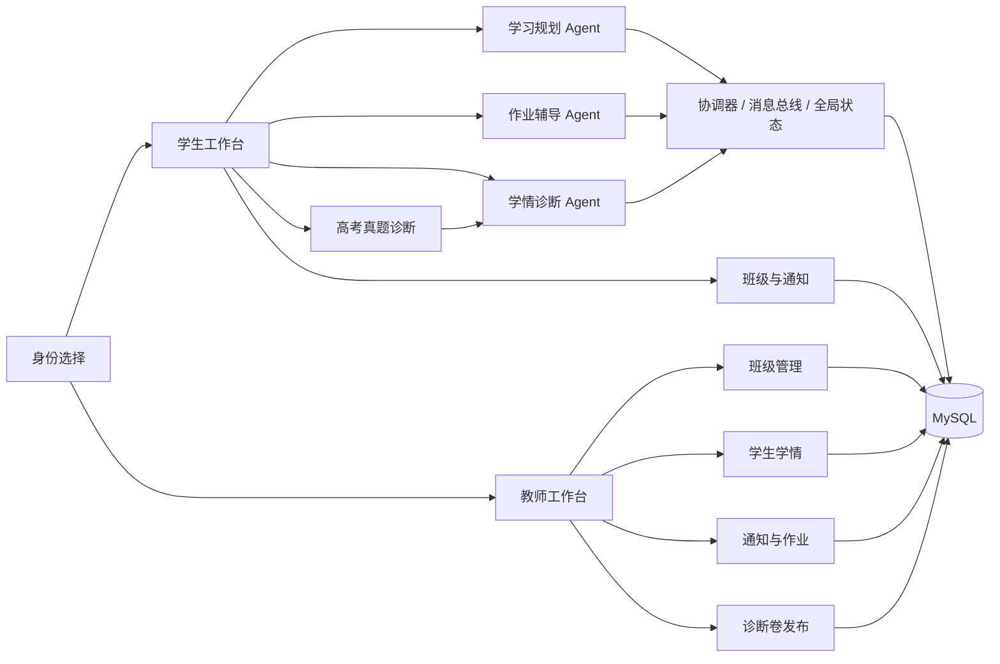

# AI Education

面向新高考全国Ⅰ卷高中生和教师的智能学习与教学协同平台。系统以 FastAPI、LangChain、LangGraph、Vue 3 和 MySQL 为基础，将个性化学习规划、作业辅导、学情诊断、高考真题诊断和教师班级管理连接成完整闭环。

当前功能基线：`8041404d`（2026-08-03）。完整进展和验收说明见 [AI Education 当前项目完整总结与进展](information/AI_Education当前项目完整总结与进展_2026-08-03.md)。

## 当前状态

当前版本已经从早期“双智能体 MVP”发展为三 Agent、学生端和教师端协同平台：

| 模块 | 当前状态 | 主要能力 |
| --- | --- | --- |
| 个性化学习规划 Agent | 已完成 | 客观诊断、目标结构化、时间建模、计划生成、发布校验、确认与重规划 |
| 作业辅导 Agent | 已完成 | 文字/图片输入、OCR 确认、启发式提示、步骤检查、知识讲解、变式训练与答案保护 |
| 学情诊断 Agent | 已完成 | 多源证据融合、掌握度估计、置信区间、稳定错误识别、学生/教师报告与人工复核 |
| 高考真题诊断 | 已完成 | 10 科、100 套试卷、2,000 道题，客观题评分和主观题多模态评分 |
| 学生平台 | 已完成 | 注册登录、规划、辅导、学情、学习记录、真题诊断、班级与通知 |
| 教师平台 | 已完成基础闭环 | 注册登录、班级管理、学生学情、通知/作业、诊断卷发布 |
| MySQL 持久化 | 已完成 | 双角色账号与会话、计划、辅导、证据、诊断、真题和班级数据 |
| 教师备课 Agent | 设计完成、尚未接入 | 已有设计文档和教案知识库，属于下一阶段能力 |

2026-08-03 验证结果：

- 后端自动化测试：58 项通过；
- Vue TypeScript 类型检查和 Vite 生产构建通过；
- 生产构建主 JavaScript 包约 912 KB，当前有代码分割优化提示；
- MySQL 5.7.39 连接成功，`ai_education` 数据库包含 19 张核心表；
- GitHub SSH、GitHub CLI 和私有仓库访问正常。

## 系统架构



三个 Agent 使用独立 LangGraph 和明确职责边界。作业辅导与真题诊断可以产生学习证据，学情诊断可以更新结构化学情状态，但它们不能绕过规划流程直接覆盖已经确认的正式学习计划。

## 核心功能

### 个性化学习规划

- 覆盖语文、数学、英语、物理、化学、生物学、思想政治、历史、地理和技术；
- 支持全国新课标Ⅰ卷地区、`3+3` 与 `3+1+2` 政策配置和选科合法性校验；
- 通过 10 题快速诊断、正式考试、真题诊断和学习记录收集客观证据；
- 支持自然语言目标结构化、知识漏洞识别、学习容量建模和前置知识排序；
- 自动安排必要任务、间隔复习、限时训练、阶段测评和机动缓冲；
- 发布前验证政策、时间预算、资源、日期、先修关系和证据充分性；
- 支持计划确认、版本历史、每日更新和动态重规划；
- 刷新或重新登录后自动恢复活动计划或最近计划。

### 作业辅导

- 支持日常对话、文字题目和图片题目；
- 支持 OCR 识别及低置信度内容确认；
- 按学科检索本地知识库和 5·3 新高考题库索引；
- 根据学生当前解题阶段，每轮推进一个合理步骤；
- 支持步骤检查、知识点讲解、答案验证、复习总结和同类题训练；
- 通过答案保护机制避免在辅导开始时直接泄漏完整答案；
- 可将经过核验的辅导结果写入学习证据。

当真实模型不可用时，系统返回明确错误，不使用规则模板冒充模型输出。`AI_EDUCATION_ALLOW_RULE_FALLBACK` 默认并建议保持为 `false`。

### 学情诊断

- 融合学生导入记录、作业辅导、快速诊断、正式考试、真题诊断和教师复核；
- 维护知识点掌握概率、题型状态、能力维度、可信区间和证据覆盖；
- 区分 `insufficient_evidence`、`preliminary`、`stable` 和 `review_required`；
- 一次错误不会直接被判定为稳定薄弱点；
- 大模型负责生成可读解释，不得篡改结构化统计事实；
- 同时生成学生版与教师版报告，并支持教师人工复核。

### 高考真题诊断

`Knowledge/Exam/高考真题/diagnose` 当前包含：

- 10 个科目；
- 每科 10 套试卷，共 100 套；
- 每套 20 题，共 2,000 道题目实例；
- 每套 12 道选择题和 8 道主观题；
- 独立的学生题面和服务端答案库；
- 原始文档路径、哈希、题号和资源完整性记录。

选择题由服务端答案库评分。主观题支持学生上传最多 3 张作答图片，由多模态模型结合题目、标准答案和评分量表给出得分、评分点及反馈；图片不可读、置信度低于 65% 或评分依据不一致时进入人工复核。答案字段和标准答案不会通过学生题面 API 返回。

### 学生与教师平台

学生端使用蓝白色学习工作台，主要入口包括规划中心、作业辅导、学情诊断、导入学习记录、班级与通知、我的计划和知识画像。

教师端使用白绿色教学工作台，支持：

- 创建班级并生成唯一 8 位班级码；
- 查看已加入本人班级的学生及其最近计划、学情和真题诊断；
- 发布作业、放假和普通通知；
- 从 100 套诊断卷中选择并发布任务；
- 更新、关闭或归档诊断任务。

教师路由和学生路由在服务端进行角色与资源归属校验，教师只能读取自己班级中的学生。

## 技术栈

后端：

- Python 3.11；
- FastAPI、Uvicorn、Pydantic 2；
- LangChain 1.x、LangGraph 1.x、`langchain-openai`；
- PyMySQL；
- Pillow、RapidOCR、python-docx、python-pptx、pypdf；
- pytest、ruff。

前端：

- Vue 3.5；
- TypeScript 5.7；
- Vite 7；
- Vue TSC；
- Lucide Vue。

数据与模型：

- MySQL 5.7+；
- OpenAI-compatible `/v1` 模型接口；
- 多模态图片输入；
- 本地教材、题库、真题和教师教案资料。

## 目录结构

```text
AI_Education/
├── App.vue                         # 会话恢复、身份分流与工作台切换
├── components/                    # 学生端和教师端 Vue 页面
├── lib/                           # 前端认证、Agent、诊断、真题和教师 API 客户端
├── styles/                        # 学生/教师主题与响应式样式
├── src/ai_education/
│   ├── agents/                    # 三个 LangGraph Agent
│   ├── api/                       # FastAPI 路由与请求模型
│   ├── domain/                    # 领域模型、枚举和协议
│   ├── llm/                       # 模型工厂、报告、辅导和主观题评分
│   ├── orchestration/             # Agent 注册、消息总线、协调器和全局状态
│   ├── prompts/                   # 分 Agent、分科目的版本化提示词
│   ├── resources/                 # 考试政策等版本化资源
│   ├── services/                  # 课程、计划、题库、诊断和评分服务
│   ├── tools/                     # LangChain StructuredTool 适配器
│   ├── auth.py                    # 学生/教师认证和会话
│   ├── mysql_persistence.py       # MySQL 表结构和持久化实现
│   └── teacher_platform.py        # 班级、通知和诊断任务服务
├── Knowledge/                     # 本地课程、题库、真题和教师资料
├── scripts/                       # 真题题库构建及 SVG/公式修复脚本
├── tests/                         # 后端与资源完整性测试
├── docs/                          # 架构、需求追踪和 API 示例
└── information/                   # 项目总结与 Agent 工程设计文档
```

## 环境准备

所有命令从仓库根目录执行：

```bash
cd /home/mwg/dsj/data/AI_Education
conda activate Mamba
python -m pip install -e '.[dev,knowledge]'
npm install
```

复制安全配置模板：

```bash
cp .env.example .env
chmod 600 .env
```

真实密钥只能保存在服务器 `.env` 或进程环境中。不要提交 `.env`，也不要给服务端密码使用 `VITE_` 前缀。

## 配置

仓库中的 `.env.example` 使用安全默认值：LLM 和 MySQL 均为关闭状态，MySQL 默认端口为 3306。当前验收服务器通过本地反向隧道访问 MySQL，因此实际 `.env` 使用 `127.0.0.1:13306`。

```dotenv
# LLM
AI_EDUCATION_LLM_ENABLED=true
AI_EDUCATION_LLM_PROVIDER=openai
AI_EDUCATION_LLM_MODEL=gpt-5.5
AI_EDUCATION_LLM_TEMPERATURE=0.3
AI_EDUCATION_LLM_TIMEOUT_SECONDS=90
AI_EDUCATION_ALLOW_RULE_FALLBACK=false
AI_EDUCATION_MAX_RETRIES=3

OPENAI_API_KEY=<server-secret>
OPENAI_BASE_URL=<openai-compatible-v1-address>

# MySQL
AI_EDUCATION_MYSQL_ENABLED=true
AI_EDUCATION_MYSQL_HOST=127.0.0.1
AI_EDUCATION_MYSQL_PORT=13306
AI_EDUCATION_MYSQL_USER=root
AI_EDUCATION_MYSQL_PASSWORD=<server-secret>
AI_EDUCATION_MYSQL_DATABASE=ai_education
AI_EDUCATION_MYSQL_CONNECT_TIMEOUT_SECONDS=5
AI_EDUCATION_AUTH_SESSION_HOURS=168

# Frontend
VITE_AGENT_API_BASE_URL=/agent-api
VITE_AGENT_DEMO_MODE=false
```

当前服务器配置使用 OpenAI-compatible 提供方和 `gpt-5.5`；仓库不保存 API 密钥、数据库密码或真实模型服务地址。

## MySQL 持久化

后端启动时执行幂等的 `CREATE DATABASE IF NOT EXISTS` 和 `CREATE TABLE IF NOT EXISTS`，不会删除已有数据或覆盖现有账号。当前 19 张核心表包括：

```text
students                         auth_sessions
teachers                         teacher_auth_sessions
classrooms                       classroom_members
classroom_announcements          classroom_exam_assignments
student_state_records            learning_plans
homework_sessions                homework_turns
homework_variant_sessions        answer_vault_records
learning_evidence_records        learning_diagnosis_reports
teacher_reviews                  exam_diagnostic_sessions
exam_question_records
```

学生和教师密码使用带随机盐的 scrypt 哈希。浏览器保存随机会话令牌，数据库只保存令牌的 SHA-256 哈希。

## 启动服务

启动后端：

```bash
cd /home/mwg/dsj/data/AI_Education
conda activate Mamba
ai-education serve --host 0.0.0.0 --port 8000
```

启动前端：

```bash
cd /home/mwg/dsj/data/AI_Education
conda activate Mamba
npm run dev -- --host 0.0.0.0 --port 3000
```

本机访问：

- 前端：`http://127.0.0.1:3000/`；
- API 文档：`http://127.0.0.1:8000/docs`；
- 健康检查：`GET http://127.0.0.1:8000/health`。

局域网验收环境当前使用 `http://192.168.58.33:3000/`。Vite 将 `/agent-api` 代理到本机 8000 端口。

健康检查会报告模型开关和提供方、报告生成模式、图片输入、三个 Agent 图、真题题库、主观题评分以及 MySQL 持久化状态。

## 主要 API

| 范围 | 代表接口 |
| --- | --- |
| 健康与清单 | `GET /health`、`GET /api/v1/tools/manifest`、`GET /api/v1/agents/manifest` |
| 认证 | `POST /api/v1/auth/register`、`POST /api/v1/auth/login`、教师注册/登录、`GET /api/v1/auth/me` |
| 规划 | 快速诊断、`POST /api/v1/planner/initialize`、活动/最近计划、确认和重规划 |
| 作业辅导 | 题库检索、会话创建、对话轮次、OCR 确认、答案提交和变式训练 |
| 学情诊断 | 运行诊断、导入图片、写入证据、读取状态/报告和教师复核 |
| 真题诊断 | 试卷目录、题面、会话、主观题评分、提交和静态题图资源 |
| 教师平台 | 教师总览、班级、通知、诊断任务和学生学情 |
| 学生班级 | 查看班级、使用班级码加入、查看通知和诊断任务 |

请求示例见 [API examples](docs/api_examples.md)。

## 验证

后端测试：

```bash
conda activate Mamba
ruff format --check src tests
ruff check src tests
pytest -q
python -m compileall -q src tests
```

前端验证：

```bash
npm run typecheck
npm run build
npm audit --audit-level=high
```

真题资源还具有独立的完整性测试、文科材料内容测试、答案隔离测试以及 SVG/公式资源检查。

## 数据和 Git 管理

高考原始 PDF、DOCX 和大型题库资料不进入普通 Git 历史。仓库跟踪可运行的诊断卷 JSON、答案库和前端资源，同时通过 `.gitignore` 排除原始高考档案。提交前必须确认：

- `.env` 和真实密钥没有进入暂存区；
- 学生题面不包含标准答案字段；
- 大型原始资料没有误加入 Git；
- `Knowledge/Exam/高考真题/diagnose/integrity_report.json` 保持有效。

## 下一阶段

优先级建议：

1. **P0 验收稳定性**：教师端浏览器 E2E、学生/教师越权回归、通知和诊断任务 API 测试、隧道断开告警；
2. **P1 教师可用性**：学生详情、班级学情总览、任务完成率、主观题人工复核、通知编辑和已读统计；
3. **P2 智能教学**：接入教师备课 Agent 和 `Knowledge/teacher`，生成班级教学建议与分层作业；
4. **P3 生产部署**：HTTPS、反向代理、进程守护、监控、备份、CI/CD 和版本回滚。

## 相关文档

- [当前项目完整总结与进展](information/AI_Education当前项目完整总结与进展_2026-08-03.md)
- [架构说明](docs/architecture.md)
- [需求追踪](docs/requirements_traceability.md)
- [作业辅导 Agent 设计](docs/homework_tutoring_agent.md)
- [学情诊断 Agent 工程设计说明书](information/学情诊断Agent工程设计说明书_优化版.md)
- [教师备课 Agent 工程设计说明书](information/教师备课Agent工程设计说明书_优化版.md)
- [个性化学习规划需求基准](personalized_learning_planner_agent_national1.md)
