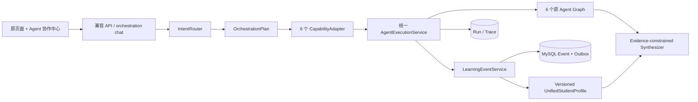

# AI 教育多 Agent 系统整改实施与专业审计报告

- 审计基线：`d9778088`（`refactor/progressive-multi-agent-orchestration`）
- 实施分支：`refactor/multi-agent-remediation-v1`
- 第一阶段提交：`e371c7c1`
- 范围：渐进式整改；保留 6 个原 Agent、原页面、原 API 和历史数据
- 结论：运行时注册的是 6 个真实在线 Agent，共声明 55 个原生 intent。不能把 `AgentRole` 枚举、服务类或页面数量计作 Agent。

## 1. 在线 Agent 事实清单

| # | 角色 / 类 / 版本 | 原生 intents | 大模型与失败行为 | 学生端入口 / API |
|---|---|---:|---|---|
| 1 | 个性化规划 `PersonalizedLearningPlannerAgent` 1.0.0 | 7 | `StructuredPlanNarrator`；模型不可用时显式规则摘要，正式计划须确认 | 规划中心；`/api/v1/planner/*`、`/api/v1/orchestration/chat` |
| 2 | 作业辅导 `HomeworkTutoringAgent` 1.0.0 | 7 | 结构化辅导生成；答案防泄漏；缺题目时追问 | 作业辅导；`/api/v1/homework/*` |
| 3 | 学情诊断 `LearningDiagnosisAgent` 1.0.0 | 5 | `StructuredDiagnosisReporter`；仅基于证据，证据不足返回采集方案 | 规划诊断及协作中心；`/api/v1/learning-diagnosis/*` |
| 4 | 教师备课 `TeacherPreparationAgent` 1.0.0 | 8 | 结构化教案生成；教师鉴权、班级匿名聚合 | 教师端；`/api/v1/teacher/*`、`/api/v1/orchestration/teacher/chat` |
| 5 | 英语阅读与语言 `EnglishReadingLanguageAgent` 2.0.0 | 9 | 阅读、词汇语法、写作、文本口语；语音转写当前明确停用 | 英语学习；`/api/v1/english-learning/*` |
| 6 | 职业/编程教育 `CareerEducationV1Agent` 3.4.0 | 19 | 岗位与项目对话、代码判题、高考编程非泄题诊断 | 职业教育四子页；`/api/v1/career-education/*` |

注册证据位于 `src/ai_education/api/app.py::AppContainer`；元数据位于 `src/ai_education/agents/*.py::metadata`。注册表只注册上述 6 个实例。

## 2. 基线问题矩阵与处理结果

| 编号 | 严重度 | 证据位置 | 基线现状 / 用户影响 | 根因 | 本轮措施 | 状态 |
|---|---|---|---|---|---|---|
| P0-01 | P0 | `orchestration/orchestrator.py` | 自然语言只覆盖有限场景，复合任务难形成真实依赖 | 缺少能力适配层和任务模型 | 6 个 `CapabilityAdapter` + 结构化 `OrchestrationPlan` + 依赖波次执行 | 完成 |
| P0-02 | P0 | 原 `components/PlannerWorkspace.vue` | 用户看不到 Agent 协作过程 | 只有 API | 新增蓝白色协作中心、对话、任务状态、handoff、画像变化和计划确认 | 完成 |
| P0-03 | P0 | 旧 Agent 各自保存结果 | 英语/编程等动作不能稳定进入统一画像 | 事件覆盖不完整 | 扩展 `LearningEventService`，接入阅读、语法、口语、代码、高考编程、项目、规划和诊断 | 完成关键路径 |
| P0-04 | P0 | `coordinator.py`、`orchestrator.py` | 双编排路径可能产生两套状态与追踪 | 旧协调器直接调用 Agent | 两者复用 `AgentExecutionService`、事件、画像、消息总线与 trace | 完成 |
| P1-01 | P1 | `student_profile_service.py` | 重复测次可能虚高，未表达可靠性和时间影响 | 画像更新过于简单 | 独立测次键、可靠度、难度、时间衰减、证据键和乐观锁版本 | 完成 |
| P1-02 | P1 | `model_router.py` | 路由只是单模型别名 | 未按能力配置 | vision/routing/code/long-context/fast/synthesis 环境路由，记录选择原因和 fallback | 完成；Token/费用取决于模型供应商 usage 回调 |
| P1-03 | P1 | 最终回复拼接 | 规则文本可能被误解为模型结论 | 无独立综合器 | 新增证据约束 `ResponseSynthesizer`；降级明确标注规则摘要/模型不可用 | 完成 |
| P1-04 | P1 | 内存消息总线 | 崩溃后事件不可恢复 | 无可靠落库中间态 | MySQL transactional outbox、失败重试状态及手动重放工具 | 完成轻量方案 |
| P1-05 | P1 | 多套知识服务 | 引用结构与检索指标不统一 | 历史演进 | 统一 `RetrievalQuery/Result/SourceCitation` 和 Recall@K/MRR 评测基线 | 协议完成；旧检索逐步包装 |
| P1-06 | P1 | trace 表和日志 | 缺少统一质量趋势、Token/费用 | 模型 SDK 未统一返回 usage | 统一 agent/model/capability/latency/error trace；不伪造缺失费用 | 部分完成，生产看板延期 |
| P2-01 | P2 | `api/app.py`、`PlannerWorkspace.vue` | 单文件较大、维护成本上升 | 长期功能累积 | 新协作 UI 独立组件与 client；不在本轮拆全部旧页面 | 延期 |
| P2-02 | P2 | V1/V2 历史服务并存 | 版本关系理解成本高 | 兼容历史数据和 API | 保持兼容，文档明确主注册实例 | 延期合并 |

## 3. 渐进式设计决策

- KEEP：6 个成熟 Agent、原业务 API、MySQL 历史表、知识库和现有页面。
- WRAP：用 `CapabilityAdapter` 将自然语言任务转换为各 Agent 原生 intent/payload；用 `AgentExecutionService` 包装调用。
- REFACTOR：总路由、计划构造、事件采集、画像更新、模型选择、最终回复和追踪。
- MERGE：新旧编排器共享执行/事件/画像/追踪层，不合并其对外协议。
- NEW：`OrchestrationPlan`、协作中心、actor 隔离表、Outbox、检索协议与 eval 数据集。
- DEFER：Kafka/Redis/向量库、全量前端拆包和删除旧版本。当前规模没有证据证明这些改动收益高于迁移风险。

## 4. 新架构与兼容关系

`MultiAgentCoordinator` 继续支持旧 `CollaborationRequest`；`ProgressiveAgentOrchestrator` 支持自然语言。二者最终都走 `AgentExecutionService`，因此共享画像读取、事件采集、消息和 trace。教师 actor 与学生画像隔离，班级上下文只能由鉴权后的服务端注入。

## 5. 统一事件覆盖矩阵

| 业务动作 | 标准事件 | 画像用途 | 幂等依据 |
|---|---|---|---|
| 作业/代码客观作答 | `QUESTION_CORRECT/WRONG` | 知识掌握度 | idempotency key + 题目/提交 ID |
| 英语阅读 | `QUESTION_CORRECT/READING_ERROR` | 阅读弱点 | reading/session/question |
| 多个独立语法句 | `GRAMMAR_ERROR` | 语法弱点 | 规范化句子哈希 + issue |
| 文本口语评分 | `SKILL_SCORE/SPEAKING_ERROR` | 口语维度 | topic + transcript 哈希 |
| 项目提交 | `PROJECT_SCORE` | 项目能力 | project/session/submission |
| 高考程序题 | `SKILL_SCORE/KNOWLEDGE_WEAK` | 高考编程能力 | paper/question/submission |
| 诊断生成 | `DIAGNOSIS_UPDATED` | 稳定诊断信号 | diagnosis ID |
| 计划确认/更新 | `PLAN_UPDATED` | 计划上下文 | plan/version |

重复同一事件不会再次更新画像；同一作答的多个标签也由独立证据键控制。Outbox 与事件同事务写入，画像更新成功后标记 processed；异常可用 `scripts/replay_learning_event_outbox.py` 重放。

## 6. RAG 与知识源审计

| 来源 | 当前方式 | 授权/隔离 | 当前结论 |
|---|---|---|---|
| `Knowledge/title/...53...` | SQLite 元数据索引 + 文件检索 | 本地项目资料；学生结果屏蔽受限答案 | 保留 |
| `Knowledge/english_reading` | 结构化阅读题库 | 答案位于 `.private_english_reading`，不下发学生 | 保留 |
| `Knowledge/taxonomy` | JSON 课程/章节目录 | 项目自有 | 保留 |
| 作业/英语/编程课程知识 | 专用 service 检索 | 引用 source_id/title/type | 用统一协议渐进包装 |
| 教师资源 | 教师备课知识服务 | 仅教师鉴权入口 | 保留并继续审计资源授权 |

已新增统一查询、结果和引用模型，以及正常、模糊、无答案、冲突来源四类金标准。当前没有评测证据支持立即引入向量数据库，因此未引入。

## 7. 数据库、迁移与回滚

新增式迁移：

- `20260811_progressive_multi_agent.sql`：统一画像、事件、运行、trace。
- `20260811_remediation_v1.sql`：迁移账本、学习事件 Outbox、非学生 actor 运行与 trace。
- 对应 `.rollback.sql` 只打印数据保留型回滚方案，不自动 DROP。

升级：`python scripts/apply_migrations.py`。迁移器记录 SHA-256，已应用文件发生漂移会拒绝运行。回滚代码时切回基线分支；数据库新增表先停止写入并归档，只有人工确认后才执行回滚脚本中的 DROP 建议。没有修改旧列、删除历史数据或更改知识库。

## 8. 验收场景映射

- A/G：英语与数学诊断可并行，规划任务依赖诊断完成；UI 展示 task/handoff，正式计划待确认。
- B/C/I：事件 ID 幂等、独立测次、乐观锁版本、MySQL 持久化与 Outbox 重放。
- D/E：编程适配器读取统一画像和项目上下文；缺项目 session 时追问，不虚构项目阶段。
- F：教师专用入口鉴权，服务端注入匿名班级摘要，不加载学生个人画像。
- H：无真实事件时返回“证据不足 + 如何采集”，不生成虚假薄弱点。
- J：不删除原路由、Agent 或页面；新增 API 字段均为向后兼容字段。

建议在协作中心测试：

1. `英语阅读一直不好，分析原因然后安排怎么练。`
2. `帮我分析最近英语和数学的问题，并安排下周学习计划。`
3. 新账号输入 `判断我最薄弱的知识点。`
4. 已开始项目后输入 `我下一步应该做什么，并帮我安排本周时间。`

## 9. 已知边界与后续风险

- 真实 Token 和费用只有模型供应商返回 usage 时才有可靠值；当前 trace 不伪造数字，生产接入统一 usage callback 后再增加成本看板。
- 现有知识服务已定义统一协议，但尚未全部迁移成一个检索实现；应按金标准评测逐个包装。
- 内存消息总线用于进程内通知，可靠恢复依赖 MySQL Outbox；若未来跨进程吞吐量显著增长，再评估队列系统。
- 语音转写按产品决定保持停用，不在本轮重新安装 Whisper。
- 本报告测试结果以最终交付时运行输出和 Git 提交为准。

## 10. 最终质量门禁结果（2026-08-11）

- Python：`python -m pytest -q`，123 项通过。真实模型首轮发现证据不足被误汇总为 failed，以及成功分支重复 tuple 字段；修复后增加回归测试并全量通过。
- 前端：`npm run typecheck` 通过；`npm run build` 通过，Vite 构建 1832 个模块，仅保留大 chunk 性能警告。
- 路由 eval：`scripts/evaluate_orchestration.py`，8/8 通过。
- MySQL：两个迁移版本及 SHA-256 与账本一致；服务重启后 3 条编排运行和 21 条执行 trace 可读取；Outbox 无积压。
- 真实模型：`gpt-5.5` 执行“英语阅读一直不好，分析原因然后安排怎么练”，HTTP 200；无证据时返回 `need_more_information`，规划为 `skipped`，未虚构薄弱点。
- 浏览器：Firefox 1440×1000 实际加载前端，登录角色页正常渲染；局域网 URL 返回 HTTP 200。
- `git diff --check` 通过。
