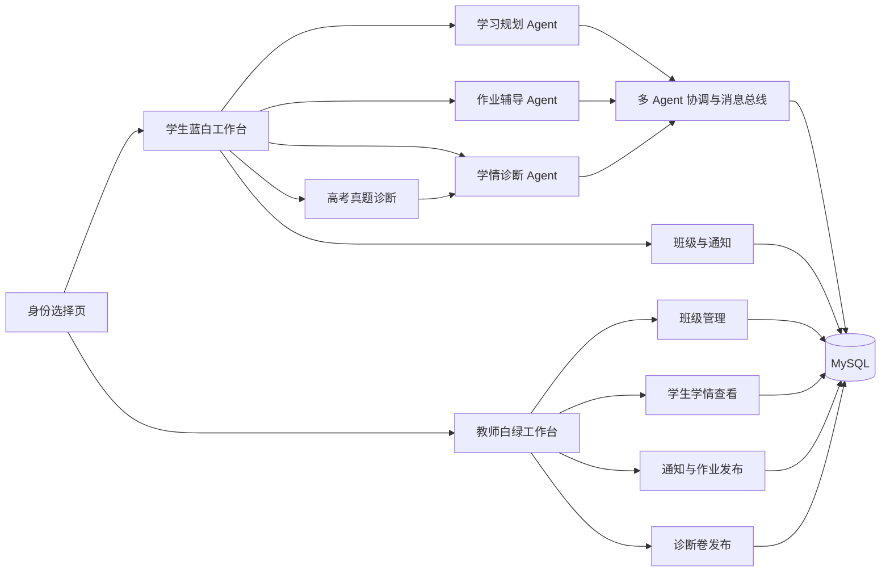

# AI Education 当前项目完整总结与进展

> 文档日期：2026-08-03
> 项目目录：`/home/mwg/dsj/data/AI_Education`
> Git 仓库：`git@github.com:Mwg806/AI_Education.git`
> 当前分支：`main`
> 本文档核对基线：`8041404d fix: route teacher registration to the correct action`
> 当前验收前端：`http://192.168.58.33:3000/`
> 当前后端：`http://192.168.58.33:8000/`，健康检查为 `GET /health`

---

## 1. 项目结论

AI Education 已由最初的“双智能体学习系统”发展为一套可实际运行的高中学习与教学协同平台。目前系统的主体包括：

1. 个性化学习规划 Agent；
2. 作业辅导 Agent；
3. 学情诊断 Agent；
4. 高考真题专业诊断与多模态主观题评分；
5. 学生端蓝白色学习工作台；
6. 教师端白绿色教学工作台；
7. 学生、教师双身份注册登录与服务端权限校验；
8. 班级、通知、作业、诊断卷发布与学生加入机制；
9. MySQL 持久化的账号、计划、辅导、诊断、考试和班级数据；
10. 覆盖 10 个科目、100 套试卷、2,000 道题目实例的高考真题诊断题库。

当前服务不是单纯的静态页面或固定模板演示。服务器健康状态显示三个 Agent 均已注册，规划、辅导、学情报告和主观题评分均使用实际大模型服务，MySQL 持久化已启用。

---

## 2. 当前运行状态

### 2.1 服务状态

| 服务 | 监听地址 | 当前状态 |
| --- | --- | --- |
| Vue/Vite 前端 | `0.0.0.0:3000` | 正常运行 |
| FastAPI 后端 | `0.0.0.0:8000` | 正常运行 |
| 本地 MySQL 反向隧道 | `127.0.0.1:13306` | 正常监听 |
| 前端验收地址 | `http://192.168.58.33:3000/` | 可访问 |
| FastAPI 健康检查 | `http://192.168.58.33:8000/health` | 返回 `status=ok` |

### 2.2 健康检查确认的能力

当前后端健康检查已确认：

- `llm_enabled=true`；
- 模型提供方为 OpenAI-compatible；
- 当前模型为 `gpt-5.5`；
- 规划报告生成模式为 `llm`；
- 作业辅导生成模式为 `llm`；
- 学情诊断报告生成模式为 `llm`；
- 图片输入已启用；
- 高考诊断题库状态为 `ready`；
- 主观题评分模式为 `multimodal_llm`；
- 规划、作业辅导、学情诊断三套 LangGraph 均为 `ready`；
- MySQL 持久化状态为 `ready`；
- 学生认证使用 MySQL 会话。

真实 API 密钥只保存在服务器 `.env` 或进程环境中，不记录在本文档，也不提交到 Git。

---

## 3. Git 仓库状态与开发里程碑

### 3.1 当前 Git 基线

- 分支：`main`；
- 远程仓库：`github.com:Mwg806/AI_Education`；
- 当前功能基线提交：`8041404d`；
- 文档编写开始前工作区无未提交修改；
- 当前代码已推送到远程 `main`。

### 3.2 关键提交

| 提交 | 内容 |
| --- | --- |
| `8041404d` | 修复教师注册错误进入登录接口的问题，增加明确校验和首次创建班级引导 |
| `966c8749` | 加入教师平台、双角色认证、班级通知、诊断卷发布、学情工作流及完整诊断资源 |
| `dbcae911` | 优化学习规划必要任务的可读展示 |
| `4f5a1364` | 加强规划验证与作业辅导对话 |
| `aa5c0231` | 加入作业辅导 Agent 与双智能体工作台 |
| `23772ce1` | 学习工作台迁移到 Vue 3 |
| `60ad7891` | 构建 PDF 驱动教材目录 |
| `4bf007b1` | 规划 Agent 支持有来源依据的全学科目标 |
| `2c2abffd` | 首次使用流程与已核验课程目录对齐 |
| `49f7c2b8` | 建设全国卷课程知识库基础 |

### 3.3 Git 资源范围

高考原始资料目录总量约 4.3GB，不适合直接进入普通 Git 历史。当前策略是：

- 原始高考 PDF、DOCX 等资料保留在服务器本地；
- 可运行的诊断卷 JSON、答案库和前端资源进入 Git；
- 生成后的 `diagnose` 目录约 261MB；
- 通过 `.gitignore` 排除原始高考档案，同时明确保留 `diagnose`；
- 提交前已确认真实 API 密钥没有进入暂存区或 Git 历史。

---

## 4. 系统总体架构



### 4.1 后端分层

| 层级 | 目录 | 职责 |
| --- | --- | --- |
| API | `src/ai_education/api/` | FastAPI 路由、请求校验、文件上传和认证入口 |
| Agent | `src/ai_education/agents/` | 三个独立 LangGraph Agent |
| LLM | `src/ai_education/llm/` | 模型工厂、结构化输出、规划叙述、辅导、诊断报告和主观题评分 |
| Services | `src/ai_education/services/` | 课程目录、目标、时间、计划、题库、诊断和评分规则 |
| Domain | `src/ai_education/domain/` | 严格领域模型、枚举、协议和学情状态 |
| Persistence | `mysql_persistence.py` 等 | MySQL 存储、会话、计划、证据、诊断和班级数据 |
| Orchestration | `src/ai_education/orchestration/` | Agent 注册、消息总线、聚合、调度和全局状态 |
| Prompts | `src/ai_education/prompts/` | 分 Agent、分科目的版本化提示词 |
| Tools | `src/ai_education/tools/` | LangChain StructuredTool 适配器 |

### 4.2 前端分层

| 目录/文件 | 职责 |
| --- | --- |
| `App.vue` | 恢复会话、身份分流、学生/教师工作台切换 |
| `components/` | 登录、规划、辅导、诊断、班级和教师平台界面 |
| `lib/auth-client.ts` | 学生/教师注册登录、会话恢复和鉴权请求 |
| `lib/agent-client.ts` | 学习规划相关 API |
| `lib/homework-client.ts` | 作业辅导会话与图片请求 |
| `lib/diagnosis-client.ts` | 学情诊断与学习记录图片处理 |
| `lib/exam-diagnosis-client.ts` | 真题目录、试卷、作答、上传和提交 |
| `lib/teacher-client.ts` | 教师班级、通知、试卷任务和学生学情 API |
| `lib/types.ts` | 前后端共享的 TypeScript 结构 |
| `styles/vue-theme.css` | 学生端蓝白主题与公共响应式样式 |

---

## 5. 技术栈

### 5.1 后端

- Python 3.11；
- FastAPI；
- Uvicorn；
- Pydantic 2；
- LangChain 1.x；
- LangGraph 1.x；
- `langchain-openai`；
- PyMySQL；
- Pillow、RapidOCR、python-docx、python-pptx；
- pypdf；
- pytest、ruff。

### 5.2 前端

- Vue 3.5；
- TypeScript 5.7；
- Vite 7；
- Vue TSC；
- Lucide Vue 图标。

### 5.3 数据与模型

- MySQL 5.7+；
- OpenAI-compatible `/v1` 模型接口；
- 当前运行模型 `gpt-5.5`；
- 多模态图片输入；
- 本地教材、题库、真题和教师教案资料。

---

## 6. 双身份认证与权限体系

### 6.1 登录流程

用户首次进入系统时先选择身份：

- “我是学生”进入蓝白色学生注册/登录页面；
- “我是教师”进入白绿色教师注册/登录页面；
- 两类账号使用不同的数据表和会话表；
- 登录成功后由服务端返回不透明 Bearer Token；
- 浏览器根据“保持登录”选择写入 `localStorage` 或 `sessionStorage`；
- 页面刷新时调用 `/api/v1/auth/me` 恢复身份与工作台。

### 6.2 密码和会话安全

- 密码最少 8 位；
- 密码采用带随机盐的 scrypt 哈希；
- 数据库存储密码哈希，不存储明文密码；
- 浏览器保存的是随机会话令牌；
- MySQL 中保存的是令牌 SHA-256 哈希；
- 会话具有到期时间和最近访问时间；
- 学生与教师会话分别存储；
- `/api/v1/teacher/*` 和 `/api/v1/student/*` 路由进行角色校验；
- 教师只能读取属于自己班级的学生；
- 静态真题图片资源公开读取，但答案库不对前端公开。

### 6.3 最近修复的教师注册问题

教师登录和注册此前共用条件分支，可能在注册时误调用 `/teacher/login`，表现为 400 错误和页面无响应。当前已完成以下修复：

- 登录按钮只调用教师登录接口；
- 注册按钮只调用教师注册接口；
- 注册信息不完整时显示具体原因；
- 注册成功后直接进入教师工作台；
- 新教师没有班级时自动弹出创建班级窗口；
- 修复提交为 `8041404d`。

---

## 7. 学生端当前能力

学生工作台当前左侧主要入口如下：

1. 规划中心；
2. 作业辅导；
3. 学情诊断；
4. 导入学习记录；
5. 班级与通知；
6. 我的计划；
7. 知识画像。

### 7.1 规划中心

个性化学习规划已由长单页改为分步流程：

1. 确定学习范围；
2. 填写目标与基本情况；
3. 完成 10 题快速诊断；
4. 设置可持续学习时间；
5. 生成、校验并确认计划。

章节基础掌握度和综合应用独立完成度不再要求学生主观填写。系统优先采用 10 题诊断、正式考试、真题诊断和学习记录等客观证据，减少自我认知偏差。

10 题快速诊断中的信心选择已经调整为四个直接按钮：

- A：非常确定；
- B：比较确定；
- C：不太确定；
- D：不确定。

点击后自动进入下一题，不再使用下拉框。

### 7.2 最近计划自动恢复

学生刷新或重新登录后，前端会请求：

- 优先读取活动计划；
- 若没有活动计划，则读取最近一次计划；
- 将最近计划重新显示在“我的计划”中；
- 不再要求每次刷新都重新完成规划。

### 7.3 作业辅导

作业辅导 Agent 支持：

- 正常日常对话；
- 文字题目输入；
- 图片题目上传；
- OCR 识别与低置信度确认；
- 按学科检索知识库和题库；
- 判断学生当前意图和解题阶段；
- 每轮推进一个合理步骤；
- 检查学生已有步骤；
- 知识点讲解；
- 同类题生成与提交；
- 答案泄漏保护；
- 将可核验辅导结果形成学习证据。

当前模式要求真实大模型生成。如果模型不可用，系统返回明确错误，不使用固定模板冒充模型输出。配置中的 `AI_EDUCATION_ALLOW_RULE_FALLBACK` 默认是 `false`。

### 7.4 导入学习记录

原独立“练习反馈”入口已移除，统一使用更完整的“导入学习记录”。学生可提供：

- 题目文字；
- 题目图片；
- 自己的解法文字；
- 解法图片；
- 对应知识点；
- 用时；
- 实际得分与题目满分。

系统将这些信息标准化为学习证据，并可进一步生成学情诊断。

### 7.5 班级与通知

学生可：

- 输入教师提供的 8 位班级码；
- 加入一个或多个班级；
- 查看作业通知；
- 查看放假通知；
- 查看普通班级通知；
- 查看教师发布的诊断卷任务；
- 点击诊断任务直接定位到指定试卷。

---

## 8. 个性化学习规划 Agent

### 8.1 Agent 定位

- Agent ID：`personalized_learning_planner_agent`；
- 角色：长期个性化学习规划；
- 版本：`1.0.0`；
- 面向新高考全国Ⅰ卷高中生；
- 使用独立 LangGraph 流程。

### 8.2 核心能力

- 首次使用信息采集；
- 地区考试政策和选科合法性校验；
- 自然语言目标结构化；
- 知识证据融合；
- 前置知识漏洞识别；
- 每周可用时间与容量建模；
- 个性化任务和路径生成；
- 间隔复习、限时训练与阶段测评；
- 计划发布前约束验证；
- 计划确认；
- 练习事件处理；
- 日常增量更新；
- 动态重规划；
- 学生版与教师版解释。

### 8.3 LangGraph 主要节点

- `dispatch`；
- `policy`；
- `goal`；
- `knowledge`；
- `time`；
- `plan`；
- `practice`；
- `adjust`；
- `get_plan`；
- `confirm`；
- `finish`。

### 8.4 计划发布约束

发布前会验证：

- 考试政策是否有效；
- 考试配置是否一致；
- 学习容量是否超限；
- 学科时间预算是否满足；
- 是否保留机动缓冲；
- 单次专注时间是否合理；
- 学习资源是否存在；
- 日期范围是否合法；
- 前置知识顺序是否正确；
- 薄弱知识是否覆盖；
- 是否包含间隔复习；
- 是否包含限时训练；
- 是否包含阶段测评；
- 地区选科组合是否合法。

客观诊断证据不足时只生成“暂定计划”，不允许把低置信度结果直接确认为正式计划。

---

## 9. 作业辅导 Agent

### 9.1 Agent 定位

- Agent ID：`homework_tutoring_agent`；
- 角色：启发式作业辅导；
- 版本：`1.0.0`；
- 支持文字和多模态图片；
- 支持正常问答而不是固定模板。

### 9.2 核心处理流程

1. 创建或恢复辅导会话；
2. 标准化文字、图片和 OCR 输入；
3. 必要时请求学生确认题目解析；
4. 判断日常交流或学科辅导意图；
5. 判断学科、题型和当前解题阶段；
6. 检索题库与学科知识库；
7. 选择辅导策略；
8. 生成提示、步骤反馈或知识讲解；
9. 检查是否泄漏完整答案；
10. 保存轮次；
11. 发布可供规划/诊断使用的学习证据事件。

### 9.3 LangGraph 主要节点

包括输入解析、普通对话、题库检索、知识检索、策略选择、提示生成、步骤分析、答案验证、复习总结、变式训练、答案保护、持久化和事件发布等节点。

### 9.4 教学边界

- 可以解释概念、定义和方法；
- 可以针对学生步骤指出具体问题；
- 可以给出下一步提示；
- 可以在学生完成后进行答案验证；
- 不应在辅导开始时直接泄漏完整答案；
- 不应把规则模板冒充真实模型回答；
- 不应在图片不清晰时臆测题目内容。

---

## 10. 学情诊断 Agent

### 10.1 Agent 定位

- Agent ID：`learning_state_diagnosis_agent`；
- 角色：多源、可追溯、增量式学情诊断；
- 版本：`1.0.0`；
- 以结构化统计状态为基础，大模型负责解释而不负责篡改事实。

### 10.2 证据来源

- 学生导入的题目与解法；
- 作业辅导过程中形成的可核验记录；
- 10 题快速诊断；
- 正式考试或模拟考试；
- 高考真题诊断逐题记录；
- 教师评价和复核。

### 10.3 诊断内容

- 知识点掌握概率；
- 题型状态；
- 能力维度；
- 可信区间；
- 有效证据数量；
- 独立测次数量；
- 难度覆盖；
- 稳定错误模式；
- 待验证原因假设；
- 学生版报告；
- 教师版报告；
- 下一步证据请求。

### 10.4 证据门槛

系统不会把一次错误直接判定为稳定薄弱点。诊断具有：

- `insufficient_evidence`：证据不足；
- `preliminary`：初步诊断；
- `stable`：稳定诊断；
- `review_required`：需要教师复核。

若结构化状态已生成，但大模型报告失败，后端会返回明确 warning，并将生成模式标记为不可用；不会补一个固定模板伪装成模型报告。

### 10.5 LangGraph 主要节点

- `dispatch`；
- `run`；
- `get_state`；
- `get_report`；
- `review`；
- `unsupported`。

诊断完成后会发送 `learning_state.updated` 事件给学习规划 Agent，但诊断 Agent 不能直接覆盖正式学习计划。

---

## 11. 高考真题专业诊断系统

### 11.1 题库规模

当前 `Knowledge/Exam/高考真题/diagnose` 状态如下：

| 指标 | 数量/规模 |
| --- | --- |
| 科目数 | 10 |
| 每科试卷 | 10 套 |
| 总试卷数 | 100 套 |
| 每套题目 | 20 道 |
| 每套选择题 | 12 道 |
| 每套主观题 | 8 道 |
| 总题目实例 | 2,000 |
| 题面与答案 JSON | 约 202 个核心 JSON 文件 |
| 诊断目录文件总数 | 22,661 |
| 目录体积 | 约 261MB |

覆盖科目：

- 语文；
- 数学；
- 英语；
- 物理；
- 化学；
- 生物；
- 历史；
- 地理；
- 思想政治；
- 技术。

`integrity_report.json` 当前为 `valid=true`，未记录完整性错误。

### 11.2 题面与答案隔离

- 学生端题面保存在各学科目录；
- 标准答案保存在后端专用 `answers/`；
- 前端 API 不返回 `correct_option` 或 `standard_answer`；
- 答案文件必须通过来源校验；
- 每道题保留原始文档路径、哈希和原题号；
- 后端在加载试卷时再次检查题面是否混入答案字段。

### 11.3 作答和评分

选择题：

- 前端统一显示 A、B、C、D；
- 点击答案后记录选择；
- 系统记录每题用时；
- 提交时在服务端与答案库比对；
- 形成逐题得分、正确率和知识点证据。

主观题：

- 学生上传最多 3 张本人作答图片；
- 图片在内存中处理；
- 模型读取题目、标准答案、评分量表和学生图片；
- 返回得分、评分点、优点、问题和反馈；
- 置信度低于 65%、图片不可读或评分量表不一致时要求人工复核；
- 模型不可用时不使用规则分数替代；
- 标准答案不会返回给学生端。

### 11.4 学习记录联动

试卷提交后自动生成：

- 每题作答记录；
- 每题用时；
- 客观题正确率；
- 主观题评分结果；
- 知识点统计；
- 总用时；
- 学习证据；
- 学情诊断 Agent 输入；
- 教师端可查看的最近真题诊断结果。

### 11.5 题目图片、材料和公式修复

已完成的资源修复包括：

- 前端通过 FastAPI 静态资源路由加载题图；
- 修复题面路径和 `/agent-api` 代理路径；
- 文科题目保留材料、上下文和选项依据；
- 修复 WMF 转 SVG 后的非法编码；
- 将旧 Symbol 字体字符映射到可移植 Unicode；
- 修复 MathType 私有区括号、根号、积分号等字符；
- 修复 π、α 等希腊字母解码；
- 修复单位缺失导致的异常字体大小；
- 使用与 Times New Roman 指标兼容的字体回退；
- 修复公式字符过紧、重叠和错误括号表现；
- 提供 `repair_exam_svg_assets.py` 批量扫描与修复脚本；
- 提供资源完整性测试和文科材料内容测试。

---

## 12. 教师平台

### 12.1 界面与身份

教师端使用独立的白绿色视觉体系，与学生端蓝白色区分。教师注册信息包括：

- 教师姓名；
- 学校名称；
- 主要任教学科；
- 教师账号；
- 密码及确认密码。

### 12.2 教师工作台栏目

1. 教学总览；
2. 学生学情；
3. 通知与作业；
4. 诊断卷发布。

### 12.3 班级管理

教师可以：

- 创建班级；
- 设置班级名称、年级和主要学科；
- 自动生成唯一 8 位班级码；
- 复制班级码发给学生；
- 查看班级学生数量；
- 切换不同班级查看学情。

班级码排除了容易混淆的字符，并在数据库设置唯一索引；若随机冲突会自动重新生成。

### 12.4 学生学情查看

教师只能看到已经加入本人班级的学生。当前展示：

- 学生姓名、账号和年级；
- 最近一次学习规划目标；
- 计划状态；
- 最近一次学情诊断；
- 学情状态版本；
- 最近一次高考真题诊断得分；
- 诊断科目。

### 12.5 通知与作业

教师可按班级发布：

- 作业通知；
- 放假通知；
- 普通通知；
- 截止时间；
- 具体内容。

学生加入班级后，可在学生端“班级与通知”页面查看。

### 12.6 诊断卷发布

教师可以：

- 从 100 套真题诊断卷中选卷；
- 设置任务标题；
- 设置截止时间；
- 发布任务；
- 将任务关闭或归档；
- 更新已经发布的任务；
- 更换指定试卷。

学生点击任务后，系统会自动切换到对应科目并预选教师指定的试卷。

---

## 13. MySQL 持久化

### 13.1 当前连接方式

服务器通过反向隧道访问本地 MySQL：

```bash
mysql -h 127.0.0.1 -P 13306 -u root -p
```

数据库名称为 `ai_education`。真实数据库密码只保存在服务器配置中，不写入 Git 和本文档。

### 13.2 初始化方式

后端启动时执行幂等初始化：

- `CREATE DATABASE IF NOT EXISTS`；
- `CREATE TABLE IF NOT EXISTS`；
- 不删除已有数据；
- 不覆盖现有用户记录；
- 表使用 InnoDB、主键、唯一索引和外键约束。

### 13.3 当前 19 张核心表

| 表 | 用途 |
| --- | --- |
| `students` | 学生账号与基本档案 |
| `auth_sessions` | 学生登录会话 |
| `teachers` | 教师账号与学校、学科信息 |
| `teacher_auth_sessions` | 教师登录会话 |
| `classrooms` | 教师创建的班级和班级码 |
| `classroom_members` | 学生与班级成员关系 |
| `classroom_announcements` | 作业、放假和普通通知 |
| `classroom_exam_assignments` | 教师发布的诊断卷任务 |
| `student_state_records` | 学生通用状态快照 |
| `learning_plans` | 版本化学习计划 |
| `homework_sessions` | 作业辅导会话 |
| `homework_turns` | 作业辅导对话轮次 |
| `homework_variant_sessions` | 同类题/变式训练会话 |
| `answer_vault_records` | 隔离保存的答案相关记录 |
| `learning_evidence_records` | 结构化学习证据 |
| `learning_diagnosis_reports` | 学情状态和诊断报告 |
| `teacher_reviews` | 教师对诊断的复核记录 |
| `exam_diagnostic_sessions` | 高考真题诊断会话与结果 |
| `exam_question_records` | 真题诊断逐题记录 |

### 13.4 数据恢复能力

- 学生刷新后恢复最近或活动计划；
- 作业辅导会话可以持久化；
- 真题诊断会话和逐题用时可以持久化；
- 学情证据和报告可以按学生、科目读取；
- 教师刷新后恢复班级、成员、通知和试卷任务；
- 学生刷新后恢复已加入班级和通知。

---

## 14. 主要 API

### 14.1 健康与清单

- `GET /health`；
- `GET /api/v1/tools/manifest`；
- `GET /api/v1/agents/manifest`。

### 14.2 学生与教师认证

- `POST /api/v1/auth/register`；
- `POST /api/v1/auth/login`；
- `POST /api/v1/auth/teacher/register`；
- `POST /api/v1/auth/teacher/login`；
- `GET /api/v1/auth/me`；
- `POST /api/v1/auth/logout`。

### 14.3 教师平台与学生班级

- `GET /api/v1/teacher/dashboard`；
- `POST /api/v1/teacher/classrooms`；
- `GET /api/v1/teacher/classrooms/{classroom_id}`；
- `POST /api/v1/teacher/classrooms/{classroom_id}/announcements`；
- `PUT /api/v1/teacher/classrooms/{classroom_id}/exam-assignments`；
- `GET /api/v1/student/classrooms`；
- `POST /api/v1/student/classrooms/join`。

### 14.4 规划与快速诊断

- `GET /api/v1/catalog/onboarding`；
- `POST /api/v1/onboarding/sessions`；
- `GET /api/v1/onboarding/sessions/{id}/next-questions`；
- `POST /api/v1/onboarding/sessions/{id}/answers`；
- `POST /api/v1/planner/diagnostics`；
- `POST /api/v1/planner/diagnostics/{id}/submit`；
- `POST /api/v1/planner/initialize`；
- `GET /api/v1/students/{student_id}/plans/active`；
- `GET /api/v1/students/{student_id}/plans/latest`；
- `POST /api/v1/plans/{plan_id}/confirm`；
- `POST /api/v1/plans/{plan_id}/replan`；
- `POST /api/v1/planner/daily-update`。

### 14.5 高考真题诊断

- `GET /api/v1/exam-diagnostics/catalog`；
- `GET /api/v1/exam-diagnostics/papers/{paper_id}`；
- `POST /api/v1/exam-diagnostics/sessions`；
- `GET /api/v1/exam-diagnostics/sessions/{session_id}`；
- `POST /api/v1/exam-diagnostics/sessions/{session_id}/questions/{question_id}/grade`；
- `POST /api/v1/exam-diagnostics/sessions/{session_id}/submit`；
- `/api/v1/exam-diagnostics/assets/...` 静态题图资源。

### 14.6 学情诊断与学习记录

- `POST /api/v1/learning-diagnosis/run`；
- `POST /api/v1/learning-diagnosis/record-images`；
- `POST /api/v1/learning-diagnosis/evidence`；
- `GET /api/v1/learning-diagnosis/students/{student_id}/state`；
- `GET /api/v1/learning-diagnosis/reports/{diagnosis_id}`；
- `POST /api/v1/learning-diagnosis/reviews`。

### 14.7 作业辅导

- `GET /api/v1/homework/question-bank/summary`；
- `POST /api/v1/homework/question-bank/search`；
- `POST /api/v1/homework/sessions`；
- `GET /api/v1/homework/sessions/{session_id}`；
- `POST /api/v1/homework/sessions/{session_id}/turns`；
- `POST /api/v1/homework/sessions/{session_id}/ocr-confirmation`；
- `POST /api/v1/homework/questions/{question_id}/submission`；
- `POST /api/v1/homework/questions/{question_id}/variants`；
- `POST /api/v1/homework/variants/{variant_id}/submission`。

---

## 15. 知识库与教学资源

### 15.1 当前知识范围

课程与教材目录覆盖：

- 语文；
- 数学；
- 英语；
- 物理；
- 化学；
- 生物学；
- 思想政治；
- 历史；
- 地理；
- 技术。

系统保留地区、教材版本、册次、章节和 PDF 来源依据，用于规划与作业辅导检索。

### 15.2 教师教案知识库

`Knowledge/teacher` 当前约 40MB，包含高中九科教学设计、公开教案和来源目录，可用于后续教师备课 Agent、教学策略检索和教师端内容推荐。

当前教师平台主要完成班级与学生数据协同，尚未把“教师备课 Agent”正式接入教师端。仓库已经保存教师备课 Agent 的工程设计说明书，可作为下一阶段开发依据。

---

## 16. 配置与启动

### 16.1 后端关键配置

```dotenv
AI_EDUCATION_LLM_ENABLED=true
AI_EDUCATION_LLM_PROVIDER=openai
AI_EDUCATION_LLM_MODEL=gpt-5.5
AI_EDUCATION_ALLOW_RULE_FALLBACK=false

AI_EDUCATION_MYSQL_ENABLED=true
AI_EDUCATION_MYSQL_HOST=127.0.0.1
AI_EDUCATION_MYSQL_PORT=13306
AI_EDUCATION_MYSQL_USER=root
AI_EDUCATION_MYSQL_DATABASE=ai_education

OPENAI_API_KEY=<只保存在服务器环境>
OPENAI_BASE_URL=<OpenAI-compatible-v1-address>
```

### 16.2 启动后端

```bash
cd /home/mwg/dsj/data/AI_Education
conda activate Mamba
ai-education serve --host 0.0.0.0 --port 8000
```

### 16.3 启动前端

```bash
cd /home/mwg/dsj/data/AI_Education
conda activate Mamba
npm run dev -- --host 0.0.0.0 --port 3000
```

### 16.4 当前验收地址

```text
http://192.168.58.33:3000/
```

如果浏览器仍使用旧模块，建议执行强制刷新：

- Windows/Linux：`Ctrl + F5`；
- macOS：`Command + Shift + R`。

---

## 17. 已完成验证

### 17.1 自动化测试

最近完整后端测试结果：

```text
58 passed
```

覆盖内容包括：

- API 健康检查；
- 三个 Agent 清单；
- 规划流程；
- 作业辅导真实模型边界；
- 学情证据门槛；
- 学情报告生成模式；
- 图片学习记录；
- 高考题库 100 套完整性；
- 学生题面答案隔离；
- 主观题多模态评分；
- 逐题学习记录；
- 公式和图片资源；
- 文科材料完整性；
- 多 Agent 协议和服务层。

### 17.2 前端构建

最近前端构建已通过：

```bash
npm run build
```

包含：

- Vue TypeScript 类型检查；
- Vite 生产构建；
- Sites 产物准备。

当前构建的主 JavaScript 包约 912KB，Vite 会给出单包超过 500KB 的性能提示，但不影响当前运行。

### 17.3 教师平台真实链路联调

已经通过真实 HTTP 和 MySQL 完成以下闭环：

1. 注册教师；
2. 注册学生；
3. 教师创建班级；
4. 生成 8 位班级码；
5. 学生加入班级；
6. 教师发布通知；
7. 教师发布诊断卷；
8. 学生读取通知和诊断任务；
9. 教师读取班级学生；
10. 测试数据清理。

联调确认教师角色、学生角色、班级码长度、通知数量、诊断任务数量和教师可见学生数量均符合预期。

---

## 18. 当前尚未完成或需要继续增强的内容

以下内容不是当前阻塞性故障，但属于下一阶段应重点完善的功能。

### 18.1 教师平台

- 班级重命名、停用和删除界面；
- 教师移除班级成员；
- 通知已读/未读状态；
- 通知撤回、编辑和置顶；
- 按诊断任务统计未开始、进行中、已完成；
- 每次作业/试卷的班级完成率和成绩分布；
- 学生个人详情页和长期趋势图；
- 教师端人工复核主观题的完整界面；
- 多教师协同管理同一班级；
- 学校、年级、班级的组织层级和管理员角色。

### 18.2 账号体系

- 找回密码；
- 手机号或邮箱验证；
- 管理员审核教师身份；
- 登录失败频率限制；
- 会话管理和主动下线其他设备；
- 更完整的审计日志。

### 18.3 学情诊断

- 跨学科总览；
- 更长时间跨度的趋势计算；
- 将教师复核结果用于评分校准；
- 同一诊断卷的班级常模；
- 题目区分度、难度和信度分析；
- 对重复刷题、异常短时作答的进一步识别。

### 18.4 真题资源

- 对 22,000 多个资源做持续浏览器回归截图；
- 对全部数学公式进行更严格的视觉差异检查；
- 补充文科长材料的分页和阅读定位；
- 将 WMF 原始资源逐步替换为标准 SVG/PNG；
- 进一步压缩诊断资源仓库体积。

### 18.5 工程与部署

- 前端路由级代码分割，降低 912KB 主包；
- 正式生产反向代理；
- HTTPS 和域名；
- systemd、Supervisor 或容器化守护；
- 自动数据库备份；
- 自动化 CI/CD；
- 将教师平台真实 E2E 脚本纳入仓库测试；
- 增加教师 API 单元测试和权限越权测试；
- 更新根目录 README，使其从“双智能体”描述升级为当前三 Agent 与教师平台架构。

---

## 19. 建议的下一阶段开发顺序

### P0：验收稳定性

1. 为教师注册、登录、创建班级增加浏览器自动化测试；
2. 为学生/教师越权访问增加后端回归测试；
3. 增加通知、试卷任务和成员关系的 API 测试；
4. 将教师平台 E2E 脚本正式加入 `tests/`；
5. 增加服务启动和 MySQL 隧道断开告警。

### P1：教师可用性

1. 增加学生详情页；
2. 增加班级学情总览图；
3. 增加诊断任务完成情况；
4. 增加主观题人工复核；
5. 增加通知编辑、撤回和已读统计。

### P2：智能教学能力

1. 开发教师备课 Agent；
2. 接入 `Knowledge/teacher` 教案知识库；
3. 根据班级共性薄弱点自动生成教学建议；
4. 根据诊断结果推荐分层作业；
5. 形成学生、班级、教师三层分析报告。

### P3：生产部署

1. 建立 HTTPS 域名；
2. 使用正式前端静态部署；
3. 将 API 放到反向代理后；
4. 增加日志、监控、备份和告警；
5. 建立版本发布和回滚机制。

---

## 20. 重要文件索引

| 文件 | 说明 |
| --- | --- |
| `App.vue` | 双身份入口和工作台分流 |
| `components/PlannerWorkspace.vue` | 学生规划中心和学生端主框架 |
| `components/HomeworkTutorWorkspace.vue` | 作业辅导前端 |
| `components/LearningDiagnosisWorkspace.vue` | 学情诊断和学习记录 |
| `components/ExamDiagnosisWorkspace.vue` | 高考真题诊断作答 |
| `components/StudentClassroomWorkspace.vue` | 学生班级、通知和试卷任务 |
| `components/RoleSelectView.vue` | 学生/教师身份选择 |
| `components/TeacherLoginView.vue` | 教师注册与登录 |
| `components/TeacherWorkspace.vue` | 教师平台主工作台 |
| `src/ai_education/api/app.py` | FastAPI 总入口和路由 |
| `src/ai_education/auth.py` | 学生/教师认证和密码处理 |
| `src/ai_education/mysql_persistence.py` | 19 张表及全部 MySQL 持久化 |
| `src/ai_education/teacher_platform.py` | 班级、通知和诊断任务服务 |
| `src/ai_education/agents/personalized_learning_planner.py` | 学习规划 Agent |
| `src/ai_education/agents/homework_tutoring.py` | 作业辅导 Agent |
| `src/ai_education/agents/learning_diagnosis.py` | 学情诊断 Agent |
| `src/ai_education/services/exam_diagnosis.py` | 真题目录、答案隔离、评分和记录 |
| `scripts/build_exam_diagnosis_bank.py` | 真题诊断卷构建脚本 |
| `scripts/repair_exam_svg_assets.py` | SVG 批量修复入口 |
| `scripts/exam_svg_utils.py` | WMF/SVG 字符、公式和字体修复 |
| `Knowledge/Exam/高考真题/diagnose/manifest.json` | 100 套试卷目录 |
| `Knowledge/Exam/高考真题/diagnose/integrity_report.json` | 题库完整性报告 |
| `information/学情诊断Agent工程设计说明书_优化版.md` | 学情诊断设计依据 |
| `information/教师备课Agent工程设计说明书_优化版.md` | 后续教师备课 Agent 设计依据 |

---

## 21. 当前验收操作建议

### 21.1 教师端

1. 打开 `http://192.168.58.33:3000/`；
2. 选择“我是教师”；
3. 点击“教师注册”；
4. 使用 4—64 位合法教师账号和至少 8 位密码注册；
5. 注册成功后创建班级；
6. 复制 8 位班级码；
7. 发布一条通知；
8. 发布一套诊断卷；
9. 在“学生学情”查看加入班级的学生。

### 21.2 学生端

1. 退出教师账号；
2. 重新选择“我是学生”；
3. 注册或登录学生账号；
4. 打开“班级与通知”；
5. 输入教师班级码；
6. 检查通知和诊断任务；
7. 点击诊断任务并确认指定试卷已自动选中；
8. 完成部分或整套试卷，检查逐题用时和诊断结果；
9. 返回教师端检查最新学情和真题诊断记录。

---

## 22. 总结

当前项目已经形成了完整的学生学习闭环和初步教师教学闭环：

```text
学生注册 → 客观诊断 → 个性化规划 → 作业辅导 → 真题测试
    → 学习记录 → 学情更新 → 教师查看 → 教师通知/发布试卷
    → 学生继续学习与诊断
```

从工程状态看，账号、会话、计划、辅导、学情、真题和班级数据均已有持久化基础，三个 Agent 已通过统一协议运行，教师与学生拥有不同的界面和权限。当前版本已经适合继续进行功能验收和迭代开发。

下一阶段的重点不再是重新搭建基础框架，而是围绕教师侧数据分析、人工复核、任务完成统计、教师备课 Agent、自动化 E2E 和生产部署进行深化。
