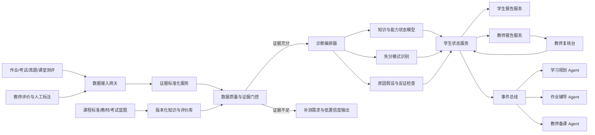
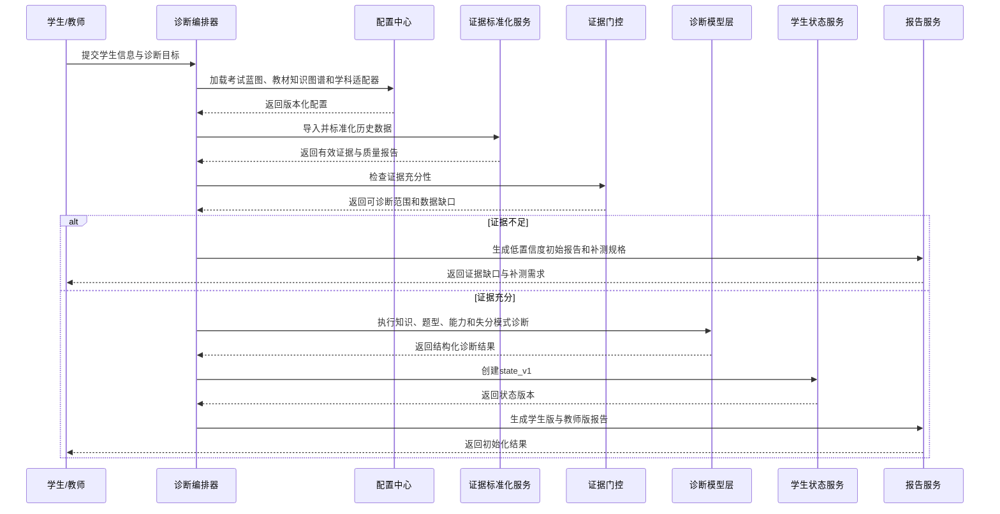
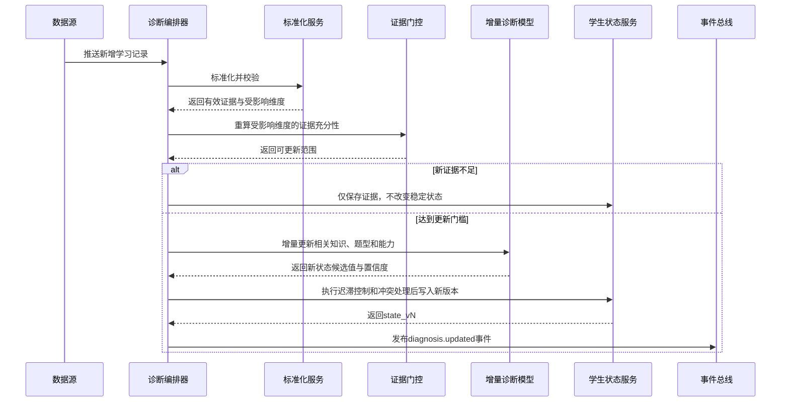

# 学情诊断 Agent 工程设计说明书（优化版）

> **适用对象**：参加中国高考全国一卷或项目配置的对应现行卷型的高中生，以及承担相关教学、复习和备考任务的高中教师。  
> **文档目标**：给出可直接用于系统设计、接口开发、模型选型、数据治理和验收测试的学情诊断 Agent 方案。  
> **版本**：v1.1

---

## 1. 项目定位

### 1.1 核心目标

学情诊断 Agent 基于学生的作业、考试、真题训练、作答过程和教师评价，持续回答以下问题：

1. 学生当前掌握了哪些知识，薄弱点位于哪个章节、知识点、题型或能力维度；
2. 当前失分是偶发错误，还是已经形成稳定错误模式；
3. 每条诊断由哪些证据支持，证据是否充分；
4. 可能的失分原因有哪些，各自置信度是多少；
5. 学生状态相较上一周期是提升、稳定、波动还是下降；
6. 还需要补充哪些测评数据，才能进一步确认诊断结论。

### 1.2 职责边界

本 Agent 负责：

- 学习证据采集、标准化与质量评估；
- 知识点、题型和学科能力状态推断；
- 失分模式识别与原因假设生成；
- 学生长期学习状态的增量更新；
- 面向学生、教师及其他 Agent 的结构化结果输出；
- 低置信度、冲突结论和高风险结论的人工复核触发。

本 Agent 不负责：

- 独立制定完整学习计划；
- 自动决定学生选科、志愿或升学路径；
- 根据单次作答推断学习态度、心理状态或人格特征；
- 在证据不足时输出确定性原因结论；
- 替代教师作出最终教学判断。

### 1.3 关键设计原则

1. **标准版本化**：课程标准、教材版本、题型体系、能力标签和考试蓝图均通过版本号加载，禁止写死。
2. **证据优先**：任何诊断必须可追溯到具体题目、作答、得分、步骤或教师评价。
3. **事实与推断分离**：系统必须区分“观察事实”“稳定模式”“原因假设”和“待验证项”。
4. **最小证据门槛**：未达到证据门槛时，只能输出“证据不足”或低置信度结论。
5. **增量更新**：新增数据仅更新受影响的知识点、题型和能力维度，避免全量重算。
6. **模型分工明确**：统计模型负责状态估计，大模型负责文本理解、步骤分析与可解释表达，规则引擎负责安全门控与一致性校验。
7. **教师可复核**：高风险、低置信度、跨模型冲突和状态突变必须进入教师复核队列。
8. **跨学科可扩展**：核心框架保持统一，具体能力维度、题型标签和评分规则由学科适配器提供。

---

## 2. 现有方案复盘与本次优化点

上一版方案已经覆盖六个核心模块、首次初始化、日常更新和多 Agent 接口，但仍存在以下不足：

| 原问题 | 可能后果 | 本次优化 |
|---|---|---|
| “高考全国一卷”被视为固定考试结构 | 年份、地区或卷型变化后诊断规则失效 | 引入 `exam_blueprint_version` 和学科适配器 |
| 大模型、规则引擎、知识追踪模型职责交叉 | 工程实现时难以确定由谁负责 | 明确能力单元类型与调用边界 |
| 只有证据数量门槛，缺少证据独立性和区分度 | 多道同质题可能造成虚假高置信度 | 增加来源独立性、难度覆盖、题型覆盖和反证检查 |
| 缺少状态更新策略 | 同一学生状态可能频繁跳变 | 增加增量更新、迟滞机制和状态冲突处理 |
| 失分原因分类过于通用 | 不同学科无法直接复用 | 采用“通用错因层 + 学科错因层”双层结构 |
| 报告生成与状态计算耦合 | 文本生成失败可能影响诊断结果 | 状态服务与报告服务解耦 |
| 验收指标缺少测量方法 | 指标难以执行 | 增加离线标注集、教师一致性和线上稳定性测评 |
| 班级聚合直接使用个人结论 | 可能泄露隐私或放大误差 | 增加匿名聚合阈值和班级级置信度 |

---

## 3. 总体架构



### 3.1 核心组件

| 组件 | 核心职责 |
|---|---|
| 诊断编排器 `DiagnosisOrchestrator` | 区分初始化与增量更新，组织模块调用，处理失败与重试 |
| 标准配置中心 `BlueprintRegistry` | 管理考试蓝图、教材版本、题型标签、能力维度和评分规则 |
| 学科适配器 `SubjectAdapter` | 提供数学、语文、英语及选考学科的专属标签、错因和评分规则 |
| 证据仓库 `EvidenceStore` | 保存原始作答、标准化证据、质量标记和来源信息 |
| 学生状态服务 `StudentStateService` | 保存知识、题型、能力、趋势和置信度状态 |
| 模型服务层 `ModelServing` | 提供知识追踪、认知诊断、步骤分析和分类模型 |
| 规则引擎 `RuleEngine` | 执行证据门控、边界检查、冲突检测和复核触发 |
| 报告服务 `ReportService` | 将结构化诊断转换为学生版和教师版报告 |
| 审计服务 `AuditLogService` | 保存数据版本、模型版本、规则版本和人工修改记录 |

### 3.2 统一调用上下文

所有内部工具或服务调用必须携带：

```json
{
  "trace_id": "链路唯一标识",
  "request_id": "请求唯一标识",
  "student_id": "脱敏学生标识",
  "subject": "数学",
  "province_code": "地区编码",
  "exam_year": 2027,
  "exam_blueprint_version": "math_national_v1_2027",
  "schema_version": "1.0",
  "timestamp": "ISO-8601时间"
}
```

---

# 4. 核心模块设计

## 4.1 模块一：诊断任务定义

### 4.1.1 模块定位

将“分析我最近哪里薄弱”等自然语言请求，转换为可执行的结构化诊断任务，并确定诊断范围、时间窗口、标准版本和职责边界。

### 4.1.2 子任务拆解

| 子任务 | 处理逻辑 | 调用时机 |
|---|---|---|
| 学生上下文解析 | 获取地区、年级、学科、教材、目标分数和备考阶段 | 首次初始化或档案变化 |
| 考试蓝图匹配 | 按地区、年份和学科匹配对应评价框架 | 每次创建诊断任务 |
| 诊断目标解析 | 将自然语言需求转为知识、题型、能力或综合诊断 | 接收请求后 |
| 时间窗口确定 | 支持近7天、近30天、指定考试、单元、学期等范围 | 每次诊断 |
| 诊断粒度确定 | 确定章节、知识点、题型、能力或试卷模块层级 | 每次诊断 |
| 信息完整性检查 | 输出缺失字段、冲突字段及必须追问的问题 | 创建任务前 |
| 职责边界检查 | 拒绝心理诊断、志愿预测等越界请求 | 每次请求 |

### 4.1.3 对应工具设计

| 工具 | 类型 | 作用 | Agent 调用方式 |
|---|---|---|---|
| `get_student_profile` | 数据服务 | 读取学生档案 | 编排器初始化时调用 |
| `load_exam_blueprint` | 配置服务 | 加载考试结构、题型和能力要求 | 任务创建时强制调用 |
| `load_subject_adapter` | 配置服务 | 加载学科标签与评分规则 | 蓝图加载后调用 |
| `resolve_diagnosis_scope` | 大模型/规则混合 | 将自然语言转为结构化范围 | 用户提出诊断请求后调用 |
| `validate_task_context` | 规则引擎 | 检查缺失、冲突和越界 | 任务入队前调用 |

### 4.1.4 输入输出规范

**输入：**

```json
{
  "student_id": "stu_001",
  "province_code": "地区编码",
  "grade": "高三",
  "subject": "数学",
  "textbook_version": "教材版本",
  "exam_year": 2027,
  "target_score": 120,
  "diagnosis_request": "分析最近三次考试的主要失分问题",
  "diagnosis_window": {
    "type": "exam_count",
    "value": 3
  }
}
```

**输出：**

```json
{
  "task_id": "diag_task_001",
  "scenario": "daily_update",
  "diagnosis_type": "综合诊断",
  "scope": {
    "subject": "数学",
    "granularity": ["知识点", "题型", "能力"],
    "time_range": "最近三次考试"
  },
  "exam_blueprint_version": "math_national_v1_2027",
  "missing_fields": [],
  "status": "ready"
}
```

---

## 4.2 模块二：学习证据采集与标准化

### 4.2.1 模块定位

将作业、考试、真题训练、课堂测评、教师评价等多源数据转为统一、可追踪、可比较的学习证据。本模块只负责“证据是否可用”，不负责判断学生是否掌握。

### 4.2.2 子任务拆解

| 子任务 | 处理逻辑 | 调用时机 |
|---|---|---|
| 多源数据接入 | 接收平台数据、批量导入、教师录入和图片解析结果 | 新数据到达时 |
| 题目身份匹配 | 识别题目来源、年份、试卷、题号和标准题目ID | 原始题目进入后 |
| 题目标签映射 | 映射知识点、题型、能力、难度、分值和认知层级 | 标签缺失时 |
| 作答过程标准化 | 统一答案、得分、步骤、用时、修改和提示信息 | 每条作答进入时 |
| 数据质量检查 | 检测缺失、重复、异常用时、评分冲突和标签冲突 | 入库前 |
| 证据来源分级 | 区分正式考试、限时训练、作业和自主练习 | 质量检查后 |
| 隐私脱敏 | 移除姓名、联系方式等非诊断必要字段 | 入模型与入库前 |

### 4.2.3 对应工具设计

| 工具 | 类型 | 作用 | Agent 调用方式 |
|---|---|---|---|
| `ingest_learning_record` | 数据接入工具 | 接收结构化或半结构化记录 | 事件触发 |
| `match_question_identity` | 检索服务 | 匹配标准题目及来源 | 题目进入后调用 |
| `map_question_tags` | 分类模型+规则 | 生成知识、题型和能力标签 | 标签不全时调用 |
| `normalize_attempt_record` | 数据处理服务 | 统一作答记录格式 | 每条记录进入时调用 |
| `validate_learning_evidence` | 规则引擎 | 检查缺失、异常和重复 | 入库前强制调用 |
| `calculate_evidence_weight` | 规则引擎 | 计算来源可信度和证据权重 | 质量检查后调用 |
| `store_learning_evidence` | 数据服务 | 保存原始记录和标准化证据 | 校验通过后调用 |

### 4.2.4 输入输出规范

**输入：**

```json
{
  "student_id": "stu_001",
  "assessment_id": "exam_2027_01",
  "assessment_type": "月考",
  "question_id": "raw_q_15",
  "response": "学生答案或步骤",
  "score": 3,
  "max_score": 5,
  "duration_seconds": 420,
  "answer_changes": 2,
  "hint_count": 0,
  "submitted_at": "2026-07-29T10:00:00+08:00"
}
```

**输出：**

```json
{
  "evidence_id": "ev_001",
  "standard_question_id": "math_func_0015",
  "knowledge_tags": ["函数单调性", "导数应用"],
  "question_type": "解答题",
  "ability_tags": ["逻辑推理", "运算求解", "规范表达"],
  "difficulty_level": 0.72,
  "source_reliability": 0.90,
  "evidence_weight": 0.86,
  "quality_flags": [],
  "status": "valid"
}
```

---

## 4.3 模块三：证据充分性判断

### 4.3.1 模块定位

作为诊断前的强制门控，判断当前证据是否足以支持知识点、题型或能力层面的结论，防止以单次错误或同质题重复作答形成虚假高置信度。

### 4.3.2 子任务拆解

| 子任务 | 处理逻辑 |
|---|---|
| 有效样本量检查 | 统计去重后的有效作答，不把重复提交计为独立证据 |
| 来源独立性检查 | 判断证据是否来自不同时间、不同测评和不同题目 |
| 知识与题型覆盖检查 | 检查是否覆盖不同表征、题型和情境 |
| 难度分布检查 | 避免只做简单题或只做高难题造成偏差 |
| 时效性检查 | 对过旧证据进行衰减，并识别长期未复测知识点 |
| 一致性与反证检查 | 检测高权重证据之间是否冲突 |
| 证据区分度检查 | 判断现有证据能否区分“不会”“不熟练”和“偶发失误” |
| 补测需求生成 | 指定需要补测的知识点、题型、难度和题量 |

### 4.3.3 对应工具设计

| 工具 | 类型 | 作用 | Agent 调用方式 |
|---|---|---|---|
| `aggregate_evidence_by_dimension` | 数据分析工具 | 按知识点、题型和能力聚合证据 | 诊断前调用 |
| `calculate_evidence_sufficiency` | 规则引擎 | 计算数量、覆盖、时效和独立性 | 聚合后调用 |
| `detect_evidence_conflict` | 规则引擎 | 识别高权重证据冲突 | 充分性判断时调用 |
| `evaluate_discrimination_power` | 规则/统计服务 | 评估证据对不同原因的区分能力 | 原因诊断前调用 |
| `generate_reassessment_request` | 大模型+测评规则 | 生成结构化补测要求 | 证据不足时调用 |
| `request_teacher_review` | 工作流工具 | 创建教师复核任务 | 标签或评分冲突时调用 |

### 4.3.4 输入输出规范

**输入：**

```json
{
  "student_id": "stu_001",
  "dimension_type": "knowledge_point",
  "dimension_id": "函数单调性",
  "evidence_ids": ["ev_001", "ev_002", "ev_003"],
  "diagnosis_window": "近30天"
}
```

**输出：**

```json
{
  "dimension_id": "函数单调性",
  "valid_evidence_count": 3,
  "independent_source_count": 2,
  "coverage_score": 0.60,
  "difficulty_balance": 0.45,
  "recency_score": 0.92,
  "consistency_score": 0.70,
  "discrimination_score": 0.52,
  "sufficiency_level": "medium",
  "allowed_output": "初步诊断",
  "missing_evidence": [
    "缺少中高难度综合题",
    "缺少不同情境下的迁移应用题"
  ]
}
```

### 4.3.5 建议的 MVP 证据门槛

> 以下仅为初始配置，正式使用前应按学科、题型和真实教师标注数据校准。

| 诊断等级 | 初始门槛 |
|---|---|
| 初步知识判断 | 至少3条有效证据，且来自不少于2个时间点或2次独立测评 |
| 稳定薄弱判断 | 至少5条有效证据，覆盖至少2种题型或表征 |
| 原因假设 | 至少2次相似错误模式，并具备步骤、用时或修改数据之一 |
| 高置信度结论 | 证据充分、来源独立、结果一致，且无明显标签或评分冲突 |
| 证据不足 | 单次作答、同一题重复提交、题目标签缺失或难度信息不可用 |

---

## 4.4 模块四：知识、题型与学科能力状态诊断

### 4.4.1 模块定位

在证据门控通过后，推断学生在知识点、题型和学科能力维度上的当前状态。输出采用概率、等级、趋势和置信度，不使用简单的“会/不会”二元标签。

### 4.4.2 子任务拆解

| 子任务 | 处理逻辑 |
|---|---|
| 知识掌握估计 | 综合正确率、难度、得分、提示、时间和历史状态 |
| 先修关系追踪 | 沿知识图谱检查薄弱点是否可能由前置知识造成 |
| 题型表现诊断 | 分析同类题目的正确率、得分率、步骤完整性和耗时 |
| 学科能力诊断 | 根据学科适配器计算对应能力维度，不跨学科硬套标签 |
| 失分贡献分析 | 统计知识点、题型和能力对总失分的贡献 |
| 趋势分析 | 对比多个时间窗口，识别提升、稳定、波动和下降 |
| 多模型融合 | 融合知识追踪、认知诊断、规则结果与教师评价 |
| 状态迟滞控制 | 防止一次异常导致状态从“掌握”直接跳到“薄弱” |

### 4.4.3 对应工具设计

| 工具 | 类型 | 作用 | Agent 调用方式 |
|---|---|---|---|
| `estimate_mastery_state` | 知识追踪模型 | 输出知识掌握概率 | 证据充分后调用 |
| `run_cognitive_diagnosis` | 认知诊断模型 | 估计能力属性掌握模式 | 数据规模满足条件时调用 |
| `evaluate_question_type_performance` | 数据分析工具 | 计算题型得分率、耗时与稳定性 | 每次综合诊断调用 |
| `evaluate_subject_ability_profile` | 学科适配器+模型 | 生成学科能力画像 | 能力标签完整时调用 |
| `trace_prerequisite_risk` | 知识图谱工具 | 定位潜在前置知识风险 | 发现薄弱点后调用 |
| `calculate_score_loss_contribution` | 数据分析工具 | 计算各维度失分贡献 | 考试诊断时调用 |
| `merge_diagnosis_results` | 融合服务 | 合并模型、规则和教师评价 | 子诊断完成后调用 |
| `apply_state_hysteresis` | 规则引擎 | 控制状态跳变和置信度变化 | 写入状态前调用 |

### 4.4.4 输入输出规范

**输入：**

```json
{
  "student_id": "stu_001",
  "subject": "数学",
  "evidence_summary": [
    {
      "dimension_id": "函数单调性",
      "valid_evidence_count": 8,
      "weighted_accuracy": 0.62,
      "average_difficulty": 0.65
    }
  ],
  "previous_state_version": "state_v12",
  "curriculum_graph_version": "math_graph_v3"
}
```

**输出：**

```json
{
  "knowledge_states": [
    {
      "knowledge_id": "函数单调性",
      "mastery_probability": 0.58,
      "mastery_level": "待巩固",
      "confidence": 0.82,
      "trend": "下降",
      "prerequisite_risks": ["函数概念", "导数符号判断"],
      "evidence_ids": ["ev_001", "ev_002"]
    }
  ],
  "ability_states": [
    {
      "ability_id": "逻辑推理",
      "level": "中等",
      "confidence": 0.75
    }
  ],
  "score_loss": {
    "estimated_lost_score": 12,
    "main_dimensions": ["函数综合题", "规范表达"]
  }
}
```

---

## 4.5 模块五：失分模式与原因假设

### 4.5.1 模块定位

从多次作答与失分中识别稳定模式，并生成可验证的原因假设。该模块不直接断言“学生粗心”或“基础差”，而是输出候选原因、支持证据、反证和置信度。

### 4.5.2 子任务拆解

| 子任务 | 处理逻辑 |
|---|---|
| 错误位置识别 | 对比学生步骤、参考答案和评分细则，定位首次关键错误 |
| 通用错因分类 | 分类为知识、方法、审题、运算、表达、时间或随机失误 |
| 学科错因分类 | 由学科适配器细分，如数学中的定义域遗漏、英语中的语篇指代误判 |
| 重复模式检测 | 检查同类错误是否跨题目、跨测评重复出现 |
| 时间行为分析 | 识别异常快答、超时、试卷后段集中失分等行为模式 |
| 原因假设生成 | 生成多个候选原因，不输出单一绝对结论 |
| 反证检查 | 检索与当前假设冲突的高权重证据 |
| 区分性补测设计 | 生成可区分不同原因的补测规格，而非直接生成最终练习计划 |

### 4.5.3 对应工具设计

| 工具 | 类型 | 作用 | Agent 调用方式 |
|---|---|---|---|
| `compare_solution_steps` | NLP/多模态模型 | 比较学生步骤与评分细则 | 有主观题步骤时调用 |
| `classify_error_type` | 分类模型+规则 | 识别通用及学科专属错因 | 错误定位后调用 |
| `detect_repeated_error_pattern` | 序列分析工具 | 检测跨题目和跨考试模式 | 综合诊断时调用 |
| `analyze_time_behavior` | 行为分析工具 | 识别时间分配与异常作答 | 有用时数据时调用 |
| `generate_cause_hypotheses` | 大模型推理工具 | 生成候选原因与解释 | 模式识别后调用 |
| `check_counter_evidence` | 规则引擎 | 搜索反证和冲突证据 | 原因输出前强制调用 |
| `design_disambiguation_test` | 测评规格工具 | 生成补测目标、题型和难度要求 | 低置信度时调用 |

### 4.5.4 输入输出规范

**输入：**

```json
{
  "student_id": "stu_001",
  "error_records": [
    {
      "question_id": "math_func_0015",
      "error_step": "导数符号区间判断错误",
      "duration_seconds": 420,
      "score_loss": 2
    }
  ],
  "historical_patterns": [],
  "teacher_annotations": []
}
```

**输出：**

```json
{
  "observed_facts": [
    "近三次函数解答题中均出现导数符号区间判断错误"
  ],
  "error_pattern": {
    "type": "重复性方法错误",
    "frequency": 3,
    "stability": "medium"
  },
  "cause_hypotheses": [
    {
      "cause": "不能稳定完成导数符号表构建",
      "confidence": 0.78,
      "supporting_evidence": ["ev_001", "ev_006", "ev_009"],
      "counter_evidence": []
    },
    {
      "cause": "区间端点处理不规范",
      "confidence": 0.55,
      "supporting_evidence": ["ev_006"],
      "counter_evidence": ["ev_010"]
    }
  ],
  "verification_required": true,
  "reassessment_spec": {
    "knowledge_ids": ["导数符号判断"],
    "question_count": 2,
    "difficulty_distribution": ["中等", "中高"],
    "target_discrimination": ["方法掌握", "端点处理"]
  }
}
```

---

## 4.6 模块六：状态更新、报告与多 Agent 协同

### 4.6.1 模块定位

将本次诊断写入学生长期状态，并生成面向学生、教师和其他 Agent 的差异化输出。状态计算、文本报告和事件发布必须解耦，任何报告生成失败都不得影响结构化状态保存。

### 4.6.2 子任务拆解

| 子任务 | 处理逻辑 |
|---|---|
| 状态增量更新 | 仅更新受新增证据影响的知识点、题型和能力维度 |
| 历史版本保存 | 保存更新前后状态，支持趋势分析、审计和回滚 |
| 状态冲突处理 | 新旧结论冲突时降低置信度或触发复核 |
| 学生报告生成 | 使用可理解、非标签化语言呈现结论与证据 |
| 教师报告生成 | 展示分布、失分贡献、趋势、反证和复核项 |
| 班级匿名聚合 | 达到最小人数阈值后才输出班级共性问题 |
| Agent 接口输出 | 向学习规划、作业辅导和教师备课 Agent 发布结构化事件 |
| 教师反馈回流 | 接收教师纠正并形成新的状态版本 |
| 审计记录 | 保存数据、模型、规则、人工修改和发布时间 |

### 4.6.3 对应工具设计

| 工具 | 类型 | 作用 | Agent 调用方式 |
|---|---|---|---|
| `resolve_state_conflict` | 规则引擎 | 处理新旧状态冲突 | 更新前调用 |
| `update_student_state` | 状态服务 | 生成新状态版本 | 诊断完成后调用 |
| `generate_student_report` | 大模型服务 | 生成学生版解释 | 状态保存成功后调用 |
| `generate_teacher_report` | 大模型服务 | 生成教师版报告 | 状态保存成功后调用 |
| `aggregate_class_diagnosis` | 匿名聚合工具 | 输出班级共性问题 | 教师请求班级报告时调用 |
| `publish_diagnosis_event` | 事件总线工具 | 向其他 Agent 发布事件 | 状态更新后调用 |
| `apply_teacher_correction` | 人工反馈工具 | 接收教师修正 | 教师提交复核后调用 |
| `store_audit_log` | 审计服务 | 保存版本和修改记录 | 每次状态变化时调用 |

### 4.6.4 输入输出规范

**输入：**

```json
{
  "student_id": "stu_001",
  "task_id": "diag_task_001",
  "previous_state_version": "state_v12",
  "diagnosis_result": {
    "knowledge_states": [],
    "ability_states": [],
    "error_hypotheses": []
  },
  "model_version": "diagnosis_model_v2.1"
}
```

**输出：**

```json
{
  "student_id": "stu_001",
  "state_version": "state_v13",
  "updated_dimensions": ["函数单调性", "导数应用", "逻辑推理"],
  "review_required": false,
  "student_report_id": "report_stu_001",
  "teacher_report_id": "report_teacher_001",
  "published_events": [
    "diagnosis.updated",
    "learning_plan.refresh_required"
  ]
}
```

---

# 5. 核心数据对象

## 5.1 学生档案 `StudentProfile`

```json
{
  "student_id": "stu_001",
  "province_code": "地区编码",
  "grade": "高三",
  "subjects": ["语文", "数学", "英语"],
  "elective_subjects": ["物理", "化学", "生物"],
  "textbook_versions": {
    "数学": "教材版本"
  },
  "exam_year": 2027,
  "target_scores": {
    "数学": 120
  },
  "current_stage": "一轮复习",
  "profile_version": "profile_v3"
}
```

## 5.2 学习证据 `LearningEvidence`

```json
{
  "evidence_id": "ev_001",
  "student_id": "stu_001",
  "assessment_id": "exam_001",
  "question_id": "q_001",
  "knowledge_tags": [],
  "ability_tags": [],
  "score": 3,
  "max_score": 5,
  "duration_seconds": 420,
  "response_content": "学生答案",
  "step_trace": [],
  "source_reliability": 0.90,
  "evidence_weight": 0.86,
  "quality_flags": [],
  "occurred_at": "ISO-8601时间"
}
```

## 5.3 学生状态 `StudentLearningState`

```json
{
  "student_id": "stu_001",
  "subject": "数学",
  "state_version": "state_v13",
  "knowledge_states": [
    {
      "knowledge_id": "函数单调性",
      "mastery_probability": 0.58,
      "confidence": 0.82,
      "trend": "下降",
      "evidence_count": 8,
      "last_updated_at": "ISO-8601时间"
    }
  ],
  "ability_states": [],
  "question_type_states": [],
  "risk_items": [],
  "updated_at": "ISO-8601时间"
}
```

## 5.4 诊断结果 `DiagnosisResult`

```json
{
  "diagnosis_id": "diag_001",
  "student_id": "stu_001",
  "subject": "数学",
  "diagnosis_window": "近30天",
  "observed_facts": [],
  "knowledge_states": [],
  "ability_states": [],
  "error_patterns": [],
  "cause_hypotheses": [],
  "evidence_gaps": [],
  "overall_confidence": 0.78,
  "review_required": false,
  "model_version": "diagnosis_model_v2.1",
  "rule_version": "diagnosis_rules_v1.4"
}
```

---

# 6. 首次初始化完整工作流

## 6.1 适用场景

- 学生第一次进入系统；
- 某一学科第一次启用诊断；
- 地区、教材版本或考试蓝图发生变化；
- 历史数据无法直接映射到当前标准；
- 模型或知识图谱发生重大版本升级，需要重建基线状态。

## 6.2 初始化流程



## 6.3 初始化步骤与失败处理

| 顺序 | 动作 | 工具 | 失败处理 |
|---|---|---|---|
| 1 | 创建或读取学生档案 | `get_student_profile` | 缺失关键字段则追问，不创建正式诊断任务 |
| 2 | 加载考试蓝图 | `load_exam_blueprint` | 无匹配版本时停止高考能力诊断 |
| 3 | 加载学科适配器和知识图谱 | `load_subject_adapter`、`load_curriculum_graph` | 降级为章节和题型层面诊断 |
| 4 | 导入历史数据 | `ingest_learning_record` | 记录失败来源并继续处理其余数据 |
| 5 | 标准化和质量检查 | `normalize_attempt_record`、`validate_learning_evidence` | 异常数据进入隔离区 |
| 6 | 证据门控 | `calculate_evidence_sufficiency` | 生成补测需求，不输出确定性诊断 |
| 7 | 初始状态估计 | `estimate_mastery_state` 等 | 主模型失败时降级到规则模型 |
| 8 | 创建初始状态 | `update_student_state` | 写入失败则不发布报告和事件 |
| 9 | 生成双端报告 | 报告服务 | 失败时仅返回结构化 JSON |
| 10 | 发布协同事件 | `publish_diagnosis_event` | 进入幂等重试队列 |

## 6.4 初始化完成标准

必须生成：

1. 学生档案与版本号；
2. 当前考试蓝图、教材和学科适配器版本；
3. 数据覆盖范围及质量报告；
4. 可诊断与不可诊断维度清单；
5. 初始知识、题型和能力状态；
6. 证据缺口与补测规格；
7. 初始诊断置信度；
8. `state_v1` 状态版本和完整审计日志。

---

# 7. 日常迭代更新完整工作流

## 7.1 触发条件

- 学生完成作业、练习或真题；
- 新考试成绩或评分细则发布；
- 教师补充评价、批注或复核结果；
- 学生完成诊断性补测；
- 其他 Agent 返回学习活动结果；
- 系统执行每日、每周或阶段性汇总。

## 7.2 增量更新流程



## 7.3 增量更新规则

1. 仅重算与新增证据相关的知识点、题型、能力和先修节点；
2. 单次异常只写入证据，不直接覆盖稳定状态；
3. 新旧结论冲突时降低置信度，并保留冲突标记；
4. 高权重正式考试通常高于普通自主练习，但权重必须配置化；
5. 旧证据按时间衰减，但不得物理删除；
6. 教师修正可以影响状态，但必须记录修改人、原因和前后差异；
7. 趋势变化至少需要两个连续时间窗口支持；
8. 同一事件重复投递必须幂等，不得重复更新状态；
9. 模型版本升级后，旧状态应保留，必要时执行影子重算和差异评估；
10. 低置信度更新不得自动触发高影响教学决策。

## 7.4 更新频率

| 更新对象 | 建议策略 |
|---|---|
| 单次练习证据 | 实时或准实时入库 |
| 知识状态 | 达到更新门槛后增量更新 |
| 正式考试诊断 | 成绩和评分细则完整后更新 |
| 学生简报 | 每日或每次正式测评后生成 |
| 教师班级报告 | 每周、单元结束或考试后生成 |
| 长期趋势 | 每月或每轮复习结束后生成 |
| 全量重算 | 蓝图、模型或知识图谱重大升级后执行 |

---

# 8. 多 Agent 协同接口

## 8.1 向学习规划 Agent 输出

```json
{
  "event_type": "diagnosis.updated",
  "student_id": "stu_001",
  "subject": "数学",
  "state_version": "state_v13",
  "weak_dimensions": [
    {
      "dimension_id": "函数单调性",
      "dimension_type": "knowledge",
      "mastery_probability": 0.58,
      "confidence": 0.82,
      "priority": "high"
    }
  ],
  "evidence_gaps": []
}
```

学习规划 Agent 可据此生成计划，但不得直接修改诊断状态。

## 8.2 向教师备课 Agent 输出

```json
{
  "event_type": "class_diagnosis.updated",
  "class_id": "class_001",
  "subject": "数学",
  "aggregation_threshold_met": true,
  "class_summary": {
    "common_weak_points": [
      {
        "knowledge_id": "函数单调性",
        "affected_student_ratio": 0.46,
        "average_confidence": 0.81
      }
    ],
    "common_error_patterns": [
      "导数符号区间判断错误",
      "解答过程缺少必要说明"
    ]
  },
  "recommended_focus": [
    "增加导数符号表构建示范",
    "设计分层变式练习"
  ]
}
```

## 8.3 接收作业辅导 Agent 反馈

```json
{
  "event_type": "learning_activity.completed",
  "student_id": "stu_001",
  "activity_id": "practice_001",
  "related_knowledge_ids": ["函数单调性"],
  "attempt_result": {
    "accuracy": 0.80,
    "duration_seconds": 900,
    "hint_count": 1
  }
}
```

所有其他 Agent 的反馈必须先转化为新的 `LearningEvidence`，不得直接修改掌握概率。

---

# 9. 报告输出规范

## 9.1 学生端报告

学生端重点呈现：

- 当前优势与薄弱点；
- 具体证据；
- 当前趋势；
- 高、中、低置信度及原因；
- 暂时无法判断的项目；
- 需要补充的数据或测评；
- 可供学习规划 Agent 使用的优先级信息。

禁止使用：

- “你不擅长数学”等固定能力标签；
- “你就是粗心”等人格化归因；
- 基于一次错误作出长期判断；
- 将模型概率包装为确定事实。

## 9.2 教师端报告

教师端应包括：

- 学生知识点、题型和能力状态；
- 诊断证据及反证；
- 失分贡献与优先级；
- 状态变化和时间趋势；
- 低置信度与证据不足项目；
- 需要教师复核的结论；
- 班级共性问题和不同分数段差异；
- 诊断模型、规则、蓝图和数据版本。

---

# 10. 异常处理与降级机制

| 异常场景 | 系统处理 |
|---|---|
| 考试蓝图未加载 | 停止高考能力诊断，仅输出基础学习数据报告 |
| 学科适配器缺失 | 仅输出通用知识点和题型分析 |
| 题目标签缺失 | 调用自动标注，并标记为机器标签 |
| 自动标签低置信度 | 提交教师复核，不参与高置信度诊断 |
| 只有一次作答 | 保存证据，输出“暂不足以判断” |
| 正式成绩与平台记录冲突 | 隔离冲突数据，等待教师确认 |
| 主诊断模型不可用 | 降级为难度加权规则模型 |
| 原因假设存在反证 | 降低置信度并同时展示反证 |
| 新旧状态大幅冲突 | 不覆盖稳定状态，进入人工复核 |
| 报告生成失败 | 返回结构化诊断 JSON，不影响状态存储 |
| 事件发布失败 | 写入幂等重试队列 |
| 班级样本过少 | 不输出班级聚合结果，避免隐私泄露 |

---

# 11. 人工复核机制

以下情况必须触发教师复核：

1. 题目知识点、能力标签或评分结果存在冲突；
2. 高权重正式考试与近期训练结果明显矛盾；
3. 系统准备将状态从“掌握”直接修改为“薄弱”；
4. 原因假设涉及学习态度、心理状态或个人特征；
5. 主观题自动评分与教师原评分差异超出阈值；
6. 低置信度结论将影响重要教学安排；
7. 模型或知识图谱升级导致大量学生状态突变；
8. 班级聚合结论与教师课堂观察明显不一致。

教师修正记录：

```json
{
  "review_id": "review_001",
  "teacher_id": "teacher_001",
  "diagnosis_id": "diag_001",
  "original_result": {},
  "corrected_result": {},
  "reason": "题目标签错误",
  "reviewed_at": "ISO-8601时间"
}
```

---

# 12. 非功能要求

## 12.1 性能与可靠性

| 指标 | MVP 建议目标 |
|---|---|
| 单次增量诊断 P95 延迟 | 不超过8秒 |
| 单份综合诊断报告生成 | 不超过30秒 |
| 数据接入成功率 | 不低于99% |
| 状态更新幂等性 | 重复事件不产生重复状态 |
| 服务可用性 | 不低于99.5% |
| 事件最终一致性 | 失败事件可重试且不丢失 |

## 12.2 可解释性

每条结论必须可追溯到：

- 原始题目与来源；
- 学生作答与关键步骤；
- 得分及评分细则；
- 知识点、题型和能力标签；
- 使用的模型、规则和蓝图版本；
- 诊断生成时间；
- 人工修改记录。

## 12.3 隐私与权限

- 学生身份采用脱敏 ID；
- 非必要姓名、联系方式不得进入模型提示词；
- 学生只能查看本人数据；
- 教师只能查看授权班级；
- Agent 按最小权限读取字段；
- 班级报告设置最小聚合人数阈值；
- 所有查询、修改和导出行为写入审计日志；
- 数据保存周期由学校与项目方规则配置。

---

# 13. 评估与验收

## 13.1 离线评估数据集

应构建由教师标注的验证集，至少包含：

- 题目知识点与题型标签；
- 主观题关键错误步骤；
- 学生知识状态等级；
- 稳定错误模式；
- 原因假设及教师认可度；
- 数据不足案例和冲突案例。

建议至少由两名教师独立标注，并计算一致性；争议样本由第三名教师裁决。

## 13.2 功能验收

| 验收项 | 验收要求 |
|---|---|
| 数据接入 | 支持作业、考试、真题、教师评价和其他 Agent 反馈 |
| 标准化 | 题目可映射至知识点、题型、能力、难度和评分规则 |
| 证据门控 | 单次错误不得直接形成高置信度薄弱结论 |
| 状态诊断 | 输出概率、等级、趋势、证据和置信度 |
| 失分分析 | 能定位关键错误步骤及重复模式 |
| 原因假设 | 区分事实、模式、假设和待验证项 |
| 状态更新 | 支持初始化、增量更新、版本记录和回滚 |
| 多 Agent 接口 | 输出结构化、可版本化的事件对象 |
| 人工复核 | 教师可查看、修改并记录理由 |
| 审计 | 诊断全过程可追溯 |

## 13.3 MVP 质量指标

| 指标 | 建议目标 | 测量方式 |
|---|---|---|
| 诊断证据关联完整率 | 100% | 抽查诊断结果是否均有证据ID |
| 知识点定位一致率 | 不低于85% | 与教师标注集比较 |
| 错误类型分类准确率 | 不低于80% | 与教师标注集比较 |
| 高置信度结论教师认可率 | 不低于80% | 教师复核统计 |
| 单次失误误判为稳定薄弱比例 | 低于10% | 专门反例测试集 |
| 低证据场景正确提示率 | 100% | 缺证据测试集 |
| 状态版本可追溯率 | 100% | 审计日志检查 |
| 更新稳定性 | 状态无高频无依据跳变 | 连续时序数据回放 |
| 班级聚合隐私合规率 | 100% | 权限和人数阈值测试 |

---

# 14. MVP 实施优先级

## 第一阶段：可运行版本

- 先支持数学单学科；
- 接入作业与考试数据；
- 建立知识点、题型和难度标签；
- 实现证据门控和规则型掌握状态；
- 生成学生版和教师版报告；
- 支持首次初始化与日常增量更新；
- 支持结构化事件输出和教师复核。

## 第二阶段：增强诊断

- 主观题步骤分析；
- 学科能力维度诊断；
- 失分原因假设与反证检查；
- 先修知识风险追踪；
- 班级匿名聚合；
- 多模型融合与置信度校准。

## 第三阶段：多学科扩展

- 增加语文、英语和选考学科适配器；
- 引入更成熟的知识追踪与认知诊断模型；
- 支持跨学期和跨阶段趋势分析；
- 与学习规划、作业辅导和教师备课 Agent 深度协同；
- 基于真实教学反馈持续校准模型和规则。

---

# 15. 完整执行链路

```text
诊断请求
→ 识别初始化或日常更新场景
→ 加载考试蓝图、教材知识图谱与学科适配器
→ 接入并标准化学习证据
→ 数据质量检查与隐私脱敏
→ 证据充分性、独立性和区分度判断
→ 知识、题型与学科能力状态推断
→ 失分模式识别
→ 原因假设、反证检查与补测规格生成
→ 状态迟滞控制与增量更新
→ 学生版、教师版报告生成
→ 发布多 Agent 协同事件
→ 接收教师复核和后续学习反馈
→ 进入下一轮迭代更新
```

---

## 16. 结论

该 Agent 的核心不是一次性判断学生“会不会”，而是建立一套：

- **有证据**：所有结论均可追溯；
- **有门槛**：证据不足不强行诊断；
- **有置信度**：明确结论可靠程度；
- **可更新**：支持初始化和长期增量迭代；
- **可复核**：教师可修正且全程留痕；
- **可协同**：向其他教育 Agent 输出稳定的数据接口；
- **可扩展**：通过学科适配器和版本化蓝图适配不同学科与考试要求。

最终系统应被视为“学生学习状态基础设施”，而不是单次生成一份学情报告的问答工具。
