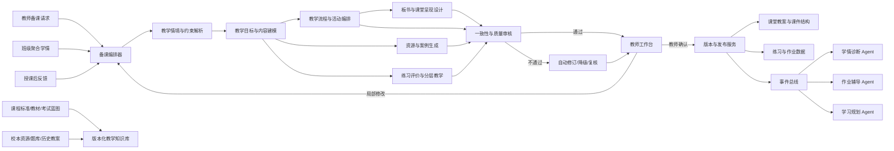
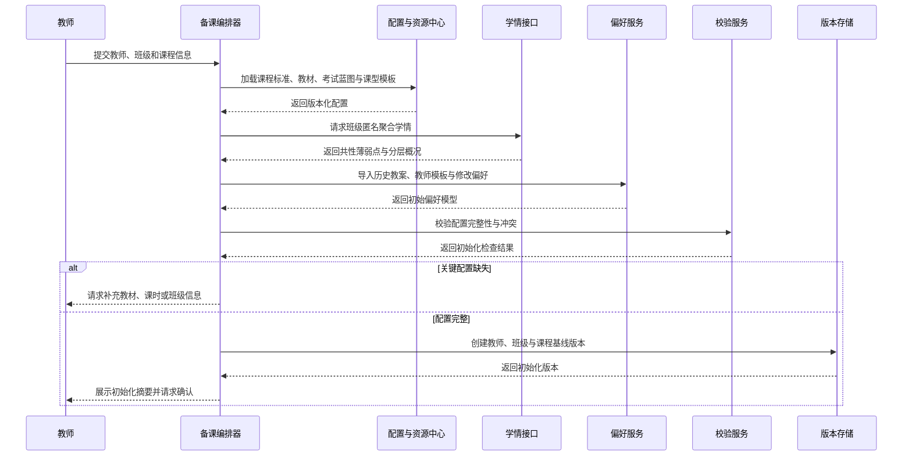
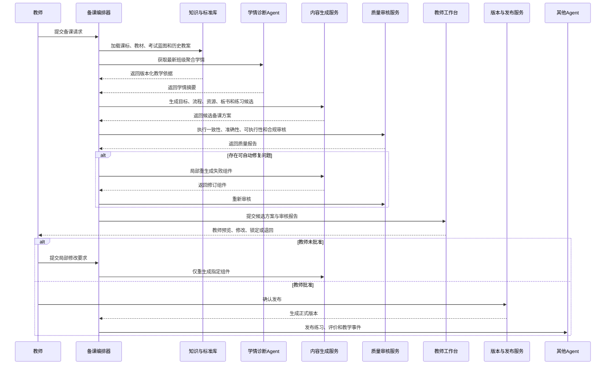
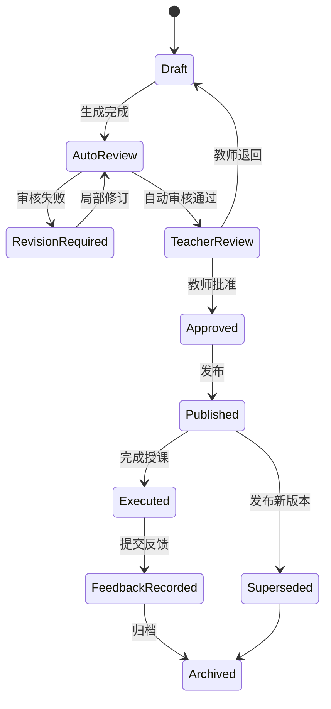

# 教师备课 Agent 工程设计说明书（优化版）

> **适用对象**：承担中国高考全国一卷或项目配置的对应现行卷型教学、复习与备考任务的高中教师。  
> **文档目标**：给出可直接用于产品设计、Agent 编排、工具开发、数据建模、质量审核和验收测试的教师备课 Agent 方案。  
> **版本**：v1.1

---

## 1. 项目定位

### 1.1 核心目标

教师备课 Agent 根据课程标准、教材内容、考试评价要求、教学进度、班级学情、课时条件和教师偏好，辅助教师生成并持续优化：

1. 课程大纲与课时目标；
2. 课堂教学流程与活动；
3. 案例、情境、例题及多媒体素材；
4. 板书结构与课堂呈现顺序；
5. 课堂检测与课后练习；
6. 分层任务、学习支架与差异化教学方案；
7. 教学目标—课堂活动—评价任务—高考能力要求一致性矩阵。

系统的最终目标不是“自动写一份教案”，而是形成一套**有依据、可执行、可编辑、可追溯、可评价、可迭代**的智能备课工作流。

### 1.2 职责边界

本 Agent 负责：

- 解析教师备课需求和真实课堂约束；
- 检索并引用课程标准、教材、题库和学校资源；
- 生成教学目标、流程、活动、资源、板书、练习和分层方案；
- 检查教学内容准确性、课时可行性与目标一致性；
- 接收学情诊断 Agent 的班级聚合结果并进行教学适配；
- 保存教师修改、版本差异和授课反馈；
- 将确认后的教学资源输出给作业辅导、学情诊断等 Agent。

本 Agent 不负责：

- 绕过教师直接发布最终教案或作业；
- 擅自改变学校教学进度、教材范围或考试安排；
- 在来源不明时伪造教材原文、真题出处或课程标准条目；
- 根据单个学生敏感信息生成公开的班级材料；
- 替代教师处理课堂纪律、学生心理或重大教育决策。

### 1.3 关键设计原则

1. **标准版本化**：课程标准、教材版本、考试蓝图、题型体系和评分规则均通过版本号加载，禁止写死。
2. **目标驱动**：任何活动、案例、板书和练习必须映射到明确的教学目标。
3. **学情适配**：默认使用班级匿名聚合学情；涉及个体差异时按权限最小化调用。
4. **教师在环**：生成、重写、发布和版本回滚均由教师确认。
5. **内容有据可查**：教材、课标、真题和外部素材必须记录来源、版本与版权状态。
6. **生成与校验分离**：内容生成服务不直接判定质量，必须经过规则、模型和教师三层审核。
7. **真实课堂约束优先**：课时、人数、设备、教学进度和教师风格属于硬约束，不得被创意内容覆盖。
8. **可复现与可迭代**：每次备课保存输入上下文、模型版本、引用资料、教师修改和授课效果。
9. **跨学科可扩展**：核心流程统一，学科目标、题型、评价标准和板书规则由学科适配器提供。

---

## 2. 方案复盘与本次优化点

在初版教师备课 Agent 提示词基础上，本说明书重点修正以下工程问题：

| 原问题 | 可能后果 | 本次优化 |
|---|---|---|
| 将“生成课程大纲、活动、素材”等视为并列功能 | 输出材料彼此割裂 | 增加目标—活动—评价—高考能力一致性矩阵 |
| “高考全国一卷”被当作固定结构 | 年份、地区或卷型变化后规则失效 | 引入 `exam_blueprint_version` 与学科适配器 |
| 资源生成与来源校验混在一起 | 容易出现虚构出处或版权风险 | 拆分资源检索、内容生成、来源核验和版权审核 |
| 只描述备课结果，缺少可执行约束 | 教案可能超时、设备不支持或组织成本过高 | 增加课时预算、班级规模、设备和组织复杂度校验 |
| 分层教学只按“基础/提升/拓展”分类 | 难以对应真实学生差异 | 基于目标分数段、掌握状态、错因和支架需求动态分层 |
| 大模型、规则引擎和数据服务职责不清 | 工程实现边界模糊 | 明确每个能力单元类型与调用方式 |
| 教师修改未进入闭环 | Agent 无法学习教师偏好 | 增加版本差异、修改原因、偏好更新和授课效果反馈 |
| 只覆盖单次备课 | 无法支持日常教学迭代 | 分别设计首次初始化与日常迭代更新工作流 |
| 验收指标只有概念，没有测量方法 | 无法实施测试 | 增加离线专家评审、线上采纳率和授课后效果指标 |

---

## 3. 总体架构



### 3.1 核心组件

| 组件 | 核心职责 |
|---|---|
| 备课编排器 `LessonPlanningOrchestrator` | 判断初始化或日常备课场景，组织七个模块调用，控制重试、降级和人工复核 |
| 标准配置中心 `TeachingBlueprintRegistry` | 管理课程标准、教材目录、考试蓝图、题型与能力标签版本 |
| 学科适配器 `SubjectAdapter` | 提供数学、语文、英语及选考学科专属目标、活动、板书、题型和评分规则 |
| 教学知识库 `TeachingKnowledgeBase` | 保存教材、课标、校本资源、历史教案、题库、案例及来源信息 |
| 学情接口服务 `ClassDiagnosisGateway` | 获取班级匿名聚合学情、分层标签和共性错因，不直接暴露无关个体信息 |
| 内容生成服务 `TeachingContentGenerator` | 生成目标、活动、案例、板书、练习和分层方案的候选内容 |
| 一致性校验器 `InstructionalAlignmentValidator` | 校验目标、活动、评价、课标和高考能力之间的映射 |
| 可执行性校验器 `ClassroomFeasibilityValidator` | 校验时间、设备、人数、材料和组织复杂度 |
| 资源合规服务 `ResourceComplianceService` | 核验来源、事实、版权、敏感内容和适龄性 |
| 教师工作台 `TeacherReviewWorkspace` | 支持局部改写、锁定内容、对比版本、批准和回滚 |
| 版本与审计服务 `LessonVersionService` | 保存备课版本、引用来源、模型规则版本和教师修改记录 |
| 反馈学习服务 `TeachingFeedbackService` | 接收授课后完成度、课堂表现和教师评价，更新偏好与模板权重 |

### 3.2 能力单元分工

| 能力单元 | 主要职责 | 禁止承担的职责 |
|---|---|---|
| 大模型推理 | 需求解析、教学目标表达、活动构思、文本组织、候选方案生成 | 直接确定事实真伪、版权状态和最终质量结论 |
| 检索工具 | 获取课程标准、教材、题库、历史教案和校本资源 | 在无来源时补造材料 |
| 规则引擎 | 字段校验、课时门控、目标映射、权限控制和复核触发 | 生成复杂教学内容 |
| 专用模型服务 | 题目难度预测、内容分类、相似度、可读性和风险检测 | 替代教师作最终教学决策 |
| 数据存储 | 保存配置、教案、资源、教师偏好、版本与反馈 | 修改业务结论 |
| 教师审核 | 最终确认、修改、发布、回滚和例外处理 | 无审计地覆盖系统记录 |

### 3.3 统一调用上下文

所有工具和服务调用必须携带：

```json
{
  "trace_id": "链路唯一标识",
  "request_id": "请求唯一标识",
  "teacher_id": "脱敏教师标识",
  "school_id": "脱敏学校标识",
  "class_id": "班级标识",
  "subject": "数学",
  "grade": "高三",
  "province_code": "地区编码",
  "exam_year": 2027,
  "exam_blueprint_version": "math_national_v1_2027",
  "curriculum_version": "curriculum_v1",
  "schema_version": "1.0",
  "timestamp": "ISO-8601时间"
}
```

---

# 4. 核心模块设计

## 4.1 模块一：教学情境与约束解析

### 4.1.1 模块定位

将教师的自然语言需求转为结构化备课任务，明确课程类型、教学对象、课时条件、资源条件、教学进度和不可违反的硬约束。

该模块是后续所有生成步骤的入口。关键字段缺失或互相冲突时，不得直接生成完整教案。

### 4.1.2 子任务拆解

| 子任务 | 处理逻辑 | 调用时机 |
|---|---|---|
| 教师与班级上下文加载 | 获取年级、学科、班级规模、学生层次、教材版本和教师偏好 | 首次初始化或每次备课开始 |
| 课型识别 | 区分新授课、复习课、专题课、实验课和试卷讲评课 | 解析教师请求时 |
| 教学范围解析 | 确定章节、课题、知识点、试卷范围和课时数量 | 每次创建任务 |
| 课堂硬约束提取 | 获取课时、设备、场地、材料、网络和班额 | 每次创建任务 |
| 教学阶段识别 | 区分高一基础、高二专题、高三一轮/二轮/冲刺 | 每次创建任务 |
| 学情摘要调用 | 获取班级共性薄弱点、分层比例和近期变化 | 教师授权且数据可用时 |
| 信息缺口识别 | 生成必须追问项和可使用默认值项 | 关键字段缺失时 |
| 冲突检测 | 识别课时过短、范围过大、设备不足等冲突 | 任务进入生成前 |

### 4.1.3 对应工具设计

| 工具 | 类型 | 作用 | Agent 调用方式 |
|---|---|---|---|
| `get_teacher_profile` | 数据服务 | 读取教师常用结构、语言风格和历史偏好 | 初始化和备课开始时调用 |
| `get_class_profile` | 数据服务 | 获取班额、层次、设备、教材和教学进度 | 每次任务创建时调用 |
| `get_class_diagnosis_summary` | Agent 接口 | 获取匿名聚合学情和共性错因 | 教师授权后调用 |
| `resolve_lesson_request` | 大模型/规则混合 | 将自然语言转为结构化备课请求 | 接收教师请求后调用 |
| `validate_lesson_context` | 规则引擎 | 检查缺失字段、范围冲突和课时可行性 | 任务入队前调用 |
| `load_lesson_type_template` | 配置服务 | 加载对应课型的流程骨架 | 课型识别后调用 |

### 4.1.4 输入输出规范

**输入：**

```json
{
  "teacher_id": "tea_001",
  "class_id": "class_001",
  "province_code": "地区编码",
  "grade": "高三",
  "subject": "数学",
  "textbook_version": "教材版本",
  "lesson_request": "设计一节45分钟的导数专题复习课，重点解决含参函数单调性问题",
  "lesson_count": 1,
  "available_equipment": ["电子白板", "投影仪"],
  "exam_year": 2027
}
```

**输出：**

```json
{
  "lesson_task_id": "lesson_task_001",
  "lesson_type": "专题复习课",
  "topic_scope": ["导数", "含参函数单调性"],
  "time_budget_minutes": 45,
  "teaching_stage": "高三二轮复习",
  "class_constraints": {
    "student_count": 48,
    "equipment": ["电子白板", "投影仪"],
    "group_activity_feasibility": "medium"
  },
  "diagnosis_summary_version": "class_diag_v12",
  "missing_fields": [],
  "conflicts": [],
  "status": "ready"
}
```

---

## 4.2 模块二：教学目标与内容建模

### 4.2.1 模块定位

依据课程标准、教材内容、考试蓝图和班级学情，生成可观察、可评价的教学目标，并构建本课知识结构、先修关系、重点难点、常见失分点和目标优先级。

该模块输出后续活动、板书、资源和练习的唯一目标基线。

### 4.2.2 子任务拆解

| 子任务 | 处理逻辑 | 调用时机 |
|---|---|---|
| 标准与教材检索 | 定位课程标准条目、教材章节和考试能力要求 | 任务上下文确认后 |
| 核心概念抽取 | 提取本课必须理解的概念、方法、公式和思想 | 检索完成后 |
| 先修知识分析 | 从知识图谱识别本课依赖的前置知识 | 内容建模时 |
| 教学目标生成 | 使用可观察动词定义知识、能力和表达目标 | 内容抽取后 |
| 目标分级 | 区分必须达成、建议达成和拓展目标 | 目标生成后 |
| 重点难点识别 | 结合学情、教材和高考失分模式确定重点难点 | 目标分级后 |
| 学情适配 | 调整目标深度、例题跨度和支架强度 | 班级诊断可用时 |
| 目标可测性检查 | 检查每个目标能否由活动或任务验证 | 输出前强制执行 |

### 4.2.3 对应工具设计

| 工具 | 类型 | 作用 | Agent 调用方式 |
|---|---|---|---|
| `load_curriculum_standard` | 检索服务 | 加载课程标准和学科核心素养要求 | 任务范围确定后调用 |
| `load_textbook_content_map` | 知识库工具 | 加载教材章节、概念和例题结构 | 与课标检索并行调用 |
| `load_exam_blueprint` | 配置服务 | 加载对应考试年度的能力和题型要求 | 高考备考场景强制调用 |
| `query_knowledge_graph` | 图谱工具 | 获取先修关系和知识依赖 | 核心概念确定后调用 |
| `generate_learning_objectives` | 大模型服务 | 生成候选教学目标 | 检索依据齐全后调用 |
| `validate_objective_measurability` | 规则引擎/分类模型 | 检查目标是否可观察、可评价 | 每组目标生成后调用 |
| `rank_objectives_by_priority` | 规则引擎 | 按课时、学情和考试权重排序 | 输出目标前调用 |

### 4.2.4 输入输出规范

**输入：**

```json
{
  "lesson_task_id": "lesson_task_001",
  "topic_scope": ["导数", "含参函数单调性"],
  "lesson_type": "专题复习课",
  "time_budget_minutes": 45,
  "curriculum_version": "curriculum_v1",
  "exam_blueprint_version": "math_national_v1_2027",
  "class_diagnosis": {
    "common_weak_points": ["分类讨论不完整", "参数临界值遗漏"],
    "ability_gaps": ["逻辑推理", "规范表达"]
  }
}
```

**输出：**

```json
{
  "content_model_id": "content_model_001",
  "learning_objectives": [
    {
      "objective_id": "obj_1",
      "description": "能够依据导数符号与参数范围完整讨论函数单调区间",
      "level": "must",
      "observable_behavior": "独立完成分类讨论并写出完整区间",
      "assessment_evidence": "课堂检测第2题",
      "exam_ability_tags": ["逻辑推理", "运算求解"]
    }
  ],
  "prerequisite_knowledge": ["导数符号与单调性", "一元二次不等式"],
  "key_points": ["参数临界值确定", "分类讨论完整性"],
  "difficult_points": ["参数变化导致的区间结构变化"],
  "common_error_patterns": ["遗漏参数等号情形", "讨论区间重叠"],
  "source_refs": ["curriculum_ref_01", "textbook_ref_18"]
}
```

---

## 4.3 模块三：教学流程与课堂活动编排

### 4.3.1 模块定位

围绕教学目标设计可在真实课堂执行的教学流程，明确每个环节的时间、教师行为、学生活动、组织方式、预期产出和评价证据。

本模块必须保证总时间不超出课时预算，并为课堂波动预留缓冲时间。

### 4.3.2 子任务拆解

| 子任务 | 处理逻辑 | 调用时机 |
|---|---|---|
| 流程骨架选择 | 按课型选择新授、复习、专题或讲评流程 | 目标确定后 |
| 环节生成 | 生成导入、诊断、讲授、探究、练习、反馈和总结 | 流程骨架加载后 |
| 目标映射 | 每个环节至少映射一个教学目标 | 环节生成时 |
| 时间预算分配 | 按目标优先级和活动复杂度分配分钟数 | 环节初稿生成后 |
| 教师行为设计 | 明确提问、示范、巡视、反馈和追问方式 | 每个环节细化时 |
| 学生活动设计 | 明确独立思考、同伴讨论、展示和练习产出 | 每个环节细化时 |
| 课堂检查点设置 | 在关键环节设置快速检测和决策分支 | 流程审核前 |
| 备用路径生成 | 为时间不足、学生卡顿、设备故障生成替代方案 | 输出前 |
| 组织复杂度校验 | 检查班额、分组、材料和切换成本 | 输出前强制执行 |

### 4.3.3 对应工具设计

| 工具 | 类型 | 作用 | Agent 调用方式 |
|---|---|---|---|
| `load_lesson_flow_template` | 配置服务 | 加载对应课型流程模板 | 目标建模完成后调用 |
| `generate_activity_candidates` | 大模型服务 | 生成多个活动候选 | 每个目标调用一次或批量调用 |
| `allocate_time_budget` | 约束求解器/规则引擎 | 分配时间并保留缓冲 | 活动候选确定后调用 |
| `validate_activity_feasibility` | 规则引擎 | 校验设备、班额、材料和组织成本 | 每轮流程生成后调用 |
| `generate_contingency_path` | 大模型/规则混合 | 生成超时、低参与和设备故障备用路径 | 主流程通过后调用 |
| `build_instructional_sequence` | 编排服务 | 生成有序活动图及依赖关系 | 全部环节确认后调用 |

### 4.3.4 输入输出规范

**输入：**

```json
{
  "content_model_id": "content_model_001",
  "lesson_type": "专题复习课",
  "time_budget_minutes": 45,
  "buffer_minutes": 3,
  "student_count": 48,
  "available_equipment": ["电子白板", "投影仪"],
  "learning_objectives": ["obj_1", "obj_2"]
}
```

**输出：**

```json
{
  "lesson_flow_id": "flow_001",
  "total_minutes": 42,
  "buffer_minutes": 3,
  "activities": [
    {
      "activity_id": "act_1",
      "stage": "诊断导入",
      "duration_minutes": 5,
      "objective_ids": ["obj_1"],
      "teacher_action": "呈现含参数漏解样例并提问错误位置",
      "student_action": "独立判断后进行同桌核对",
      "organization": "个人思考+同伴交流",
      "expected_output": "标注遗漏的参数临界值",
      "assessment_method": "举牌选择+追问",
      "decision_rule": "错误率超过40%时进入前置知识补偿分支"
    }
  ],
  "contingency_paths": [
    {
      "trigger": "核心例题讲解超时5分钟",
      "action": "取消第二个展示环节，改为课后微课补充"
    }
  ],
  "feasibility_status": "pass"
}
```

---

## 4.4 模块四：教学资源与案例生成

### 4.4.1 模块定位

为指定教学目标和课堂环节检索或生成案例、情境、例题、图表、文本和多媒体资源，并确保内容准确、适龄、可授权和可追溯。

资源服务必须优先复用授权校本资源、教材资源和题库资源；仅在检索不足时生成新内容。

### 4.4.2 子任务拆解

| 子任务 | 处理逻辑 | 调用时机 |
|---|---|---|
| 资源需求解析 | 根据活动环节确定资源类型、用途、时长和难度 | 流程初稿完成后 |
| 内部资源检索 | 检索教材、校本资源、历史教案和授权题库 | 每个资源需求产生时 |
| 外部资源检索 | 在允许的来源中检索公开或授权材料 | 内部资源不足时 |
| 资源适配 | 调整长度、语言、数据规模和呈现形式 | 检索后 |
| 新资源生成 | 生成情境、案例、例题或图表说明 | 检索结果不满足时 |
| 事实与计算校验 | 检查数据、答案、公式、史实和学科事实 | 资源入选前 |
| 来源与版权审核 | 记录出处、许可范围和是否允许改编 | 资源入库前 |
| 适龄与偏见检查 | 检查不适宜内容、刻板印象和无关敏感信息 | 输出前 |
| 教学用途标注 | 明确资源服务的目标、环节和预期作用 | 输出前 |

### 4.4.3 对应工具设计

| 工具 | 类型 | 作用 | Agent 调用方式 |
|---|---|---|---|
| `search_teaching_resources` | 检索工具 | 检索教材、校本库、题库和授权资源 | 活动资源需求生成后调用 |
| `retrieve_source_excerpt` | 检索工具 | 获取可引用的连续内容与元数据 | 资源候选入选前调用 |
| `generate_teaching_resource` | 大模型/生成模型 | 生成原创情境、案例或示意素材 | 检索不足时调用 |
| `verify_subject_facts` | 专用校验服务 | 检查数学计算、科学事实和文本知识 | 每个候选资源调用 |
| `check_resource_provenance` | 规则引擎 | 核验来源字段和许可状态 | 入选前强制调用 |
| `check_age_appropriateness` | 分类模型/规则 | 检查适龄性和偏见风险 | 输出前调用 |
| `store_resource_asset` | 资源存储 | 保存资源正文、元数据和版本 | 教师确认后调用 |

### 4.4.4 输入输出规范

**输入：**

```json
{
  "activity_id": "act_1",
  "resource_need": {
    "type": "错误案例",
    "purpose": "引出参数临界值遗漏问题",
    "subject": "数学",
    "difficulty": "medium",
    "display_time_minutes": 2
  },
  "allowed_sources": ["教材库", "校本库", "授权题库"],
  "generation_allowed": true
}
```

**输出：**

```json
{
  "resource_id": "res_001",
  "resource_type": "错误案例",
  "content": "候选案例内容",
  "purpose": "诊断导入",
  "objective_ids": ["obj_1"],
  "source_type": "generated",
  "source_refs": [],
  "copyright_status": "original_generated",
  "fact_check_status": "pass",
  "age_appropriateness": "pass",
  "teacher_review_required": true
}
```

---

## 4.5 模块五：板书与课堂呈现设计

### 4.5.1 模块定位

将教学目标、知识结构、解题方法和课堂流程转化为层级清晰、容量可控、呈现顺序明确的板书方案，并与课件、例题和课堂活动保持同步。

板书不是课程摘要，而是课堂中逐步生成的认知支架。

### 4.5.2 子任务拆解

| 子任务 | 处理逻辑 | 调用时机 |
|---|---|---|
| 板书核心信息筛选 | 仅保留核心概念、方法、关键步骤、易错点和结论 | 流程与目标确定后 |
| 空间布局设计 | 按主板区、演算区、易错区和总结区分配空间 | 内容筛选后 |
| 动态呈现顺序 | 将板书节点映射到具体课堂环节和时间点 | 布局确定后 |
| 表达规范校验 | 检查符号、术语、单位、步骤和格式 | 输出前 |
| 容量校验 | 控制板书总量，避免超出书写时间和可视区域 | 输出前 |
| 课件协同 | 区分应长期保留在板书中的内容与课件瞬时内容 | 输出前 |
| 备用简版生成 | 生成时间不足时的压缩板书版本 | 主版本完成后 |

### 4.5.3 对应工具设计

| 工具 | 类型 | 作用 | Agent 调用方式 |
|---|---|---|---|
| `extract_board_keypoints` | 大模型/规则混合 | 从目标与流程中筛选板书节点 | 流程完成后调用 |
| `generate_board_layout` | 布局生成服务 | 生成板书区域和节点关系 | 关键节点确定后调用 |
| `map_board_to_timeline` | 编排工具 | 将板书节点映射到课堂时间线 | 布局完成后调用 |
| `validate_notation_and_terms` | 学科规则引擎 | 检查术语、符号和书写规范 | 输出前强制调用 |
| `estimate_boarding_time` | 规则引擎 | 估算书写时间与容量 | 每轮方案后调用 |
| `generate_compact_board_version` | 大模型服务 | 生成时间不足时的简版 | 主方案通过后调用 |

### 4.5.4 输入输出规范

**输入：**

```json
{
  "lesson_flow_id": "flow_001",
  "learning_objectives": ["obj_1", "obj_2"],
  "key_points": ["参数临界值", "分类讨论"],
  "common_error_patterns": ["漏等号", "区间重叠"],
  "board_type": "黑板+电子白板",
  "estimated_writing_minutes": 10
}
```

**输出：**

```json
{
  "board_plan_id": "board_001",
  "layout": {
    "left": "问题情境与分类依据",
    "center": "解题主流程与参数临界值",
    "right": "易错点与总结"
  },
  "timeline_nodes": [
    {
      "minute": 8,
      "activity_id": "act_2",
      "content": "第一步：求导并确定临界参数",
      "action": "write"
    }
  ],
  "persistent_content": ["分类讨论流程", "参数临界值表"],
  "slide_only_content": ["完整长题干", "多组图像对比"],
  "estimated_writing_minutes": 9,
  "notation_validation": "pass",
  "compact_version_available": true
}
```

---

## 4.6 模块六：练习评价与分层教学

### 4.6.1 模块定位

根据教学目标、班级学情和高考题型生成课堂检测、课后练习、评分标准与分层教学方案，并确保练习结果可回流学情诊断 Agent。

分层不是固定给学生贴标签，而是针对不同任务动态配置难度、支架、完成量和反馈方式。

### 4.6.2 子任务拆解

| 子任务 | 处理逻辑 | 调用时机 |
|---|---|---|
| 测评蓝图生成 | 为每个教学目标确定题量、题型、难度和分值 | 目标完成后 |
| 题目检索与生成 | 优先检索题库，不足时生成新题或变式题 | 蓝图确定后 |
| 答案与评分细则生成 | 生成标准答案、关键步骤、分值点和常见错误 | 每道题生成后 |
| 题目质量校验 | 检查唯一性、可解性、难度、歧义和知识覆盖 | 题目入选前 |
| 分层规则生成 | 根据掌握状态、目标分数段和错因配置任务 | 班级学情可用时 |
| 学习支架生成 | 提供提示、例题、步骤模板和纠错线索 | 中低层任务生成时 |
| 课堂决策规则生成 | 根据即时正确率决定补讲、继续或分流 | 课堂检测生成后 |
| 诊断标签绑定 | 为每题绑定知识点、题型、能力和错因标签 | 发布前 |
| 回流接口生成 | 定义作答数据如何返回学情诊断 Agent | 发布前 |

### 4.6.3 对应工具设计

| 工具 | 类型 | 作用 | Agent 调用方式 |
|---|---|---|---|
| `build_assessment_blueprint` | 规则引擎 | 生成目标—题型—难度—分值配置 | 目标建模后调用 |
| `search_question_bank` | 检索工具 | 检索授权题库和历史试题 | 蓝图完成后调用 |
| `generate_question_variant` | 大模型/专用生成模型 | 生成原创题或变式题 | 题库不足时调用 |
| `solve_and_verify_question` | 符号计算/学科模型 | 验证题目可解性、答案和步骤 | 每道题入选前调用 |
| `estimate_question_difficulty` | 专用模型 | 估计难度和区分度 | 题目校验后调用 |
| `generate_scoring_rubric` | 大模型/规则混合 | 生成评分点和部分得分规则 | 主观题生成后调用 |
| `build_differentiation_plan` | 规则引擎+大模型 | 生成动态分层任务和支架 | 学情加载后调用 |
| `bind_diagnosis_tags` | 标签服务 | 绑定知识、能力、题型和错因标签 | 发布前强制调用 |

### 4.6.4 输入输出规范

**输入：**

```json
{
  "learning_objectives": ["obj_1", "obj_2"],
  "lesson_type": "专题复习课",
  "class_diagnosis": {
    "groups": [
      {
        "group_id": "support_needed",
        "ratio": 0.35,
        "main_gaps": ["分类依据不清"]
      },
      {
        "group_id": "advanced",
        "ratio": 0.2,
        "main_gaps": ["综合迁移不稳定"]
      }
    ]
  },
  "homework_time_limit_minutes": 25
}
```

**输出：**

```json
{
  "assessment_plan_id": "assess_001",
  "blueprint": [
    {
      "objective_id": "obj_1",
      "question_count": 3,
      "difficulty_distribution": ["basic", "medium", "advanced"],
      "total_score": 15
    }
  ],
  "in_class_checks": [
    {
      "question_id": "q_check_01",
      "decision_rule": "正确率低于60%时触发补偿活动act_reteach_01"
    }
  ],
  "homework_layers": [
    {
      "layer_id": "A",
      "target_group": "support_needed",
      "question_ids": ["q1", "q2", "q3"],
      "scaffolds": ["分类讨论步骤模板"]
    },
    {
      "layer_id": "C",
      "target_group": "advanced",
      "question_ids": ["q1", "q4", "q5"],
      "scaffolds": []
    }
  ],
  "diagnosis_tags_complete": true,
  "estimated_completion_minutes": 23
}
```

---

## 4.7 模块七：一致性审核与教师反馈

### 4.7.1 模块定位

对课程标准、教学目标、课堂活动、资源、板书、练习和高考能力要求进行统一审核，并将通过审核的候选教案提交教师工作台。

该模块既是质量门控，也是教师修改和授课后迭代的入口。

### 4.7.2 子任务拆解

| 子任务 | 处理逻辑 | 调用时机 |
|---|---|---|
| 目标覆盖校验 | 检查每个必须目标是否至少有活动和评价证据 | 各模块完成后 |
| 课标与考试一致性校验 | 检查内容是否超纲、漏项或错误映射 | 输出前 |
| 课时可执行性校验 | 汇总活动、板书、切换和缓冲时间 | 输出前 |
| 内容准确性校验 | 检查概念、公式、答案、史实和语言事实 | 输出前 |
| 资源合规校验 | 检查来源、版权、适龄和隐私 | 输出前 |
| 难度与学情适配校验 | 检查题目、活动和支架是否符合班级状态 | 输出前 |
| 重复与冗余检测 | 识别活动、例题和练习的重复覆盖 | 输出前 |
| 自动修订 | 对可自动修复的问题进行局部重生成 | 发现低风险问题时 |
| 教师复核 | 对冲突、低置信度和高风险内容提交教师 | 自动修订后或高风险时 |
| 修改差异记录 | 保存教师修改位置、原因和采纳状态 | 教师编辑时 |
| 授课效果回收 | 收集完成度、学生表现、超时点和教师评价 | 课后 |
| 偏好与模板更新 | 更新教师偏好和有效活动权重 | 反馈审核后 |

### 4.7.3 对应工具设计

| 工具 | 类型 | 作用 | Agent 调用方式 |
|---|---|---|---|
| `build_alignment_matrix` | 规则引擎 | 生成目标—活动—评价—能力映射 | 所有模块完成后调用 |
| `validate_instructional_alignment` | 规则引擎/模型服务 | 检查缺失映射和无效活动 | 矩阵生成后调用 |
| `validate_classroom_feasibility` | 约束求解器 | 校验总时间、设备、人数和材料 | 输出前强制调用 |
| `run_content_quality_checks` | 多模型审核 | 检查事实、答案、语言和难度 | 输出前调用 |
| `run_resource_compliance_checks` | 合规服务 | 检查来源、版权、隐私和适龄性 | 输出前调用 |
| `revise_failed_component` | 大模型服务 | 仅重写未通过审核的组件 | 低风险失败时调用 |
| `submit_teacher_review` | 工作流工具 | 将候选教案提交教师工作台 | 质量门控后调用 |
| `record_teacher_edit` | 审计服务 | 保存修改差异和原因 | 每次教师编辑时调用 |
| `collect_post_lesson_feedback` | 反馈工具 | 收集授课结果和教师评价 | 课后调用 |
| `update_teacher_preference_model` | 偏好服务 | 更新可解释的教师偏好参数 | 反馈确认后调用 |

### 4.7.4 输入输出规范

**输入：**

```json
{
  "lesson_task_id": "lesson_task_001",
  "content_model_id": "content_model_001",
  "lesson_flow_id": "flow_001",
  "resource_ids": ["res_001"],
  "board_plan_id": "board_001",
  "assessment_plan_id": "assess_001",
  "time_budget_minutes": 45
}
```

**输出：**

```json
{
  "review_result_id": "review_result_001",
  "alignment_matrix_status": "pass",
  "classroom_feasibility": {
    "status": "pass",
    "estimated_total_minutes": 43,
    "buffer_minutes": 2
  },
  "quality_issues": [
    {
      "component_id": "res_001",
      "severity": "low",
      "issue": "案例题干长度偏长",
      "action": "auto_revised"
    }
  ],
  "teacher_review_required": true,
  "publishable": false,
  "candidate_version": "lesson_v1_draft"
}
```

---

# 5. 核心数据结构

## 5.1 教学情境 `TeachingContext`

```json
{
  "teacher_id": "tea_001",
  "class_id": "class_001",
  "province_code": "地区编码",
  "grade": "高三",
  "subject": "数学",
  "textbook_version": "教材版本",
  "exam_year": 2027,
  "exam_blueprint_version": "math_national_v1_2027",
  "teaching_stage": "二轮复习",
  "class_size": 48,
  "available_equipment": ["电子白板", "投影仪"],
  "teacher_preference_version": "pref_v5",
  "class_diagnosis_version": "class_diag_v12"
}
```

## 5.2 教学目标 `LearningObjective`

```json
{
  "objective_id": "obj_1",
  "description": "能够完成含参函数单调性的完整分类讨论",
  "priority": "must",
  "observable_behavior": "独立写出分类依据、参数范围和单调区间",
  "curriculum_refs": ["curriculum_ref_01"],
  "textbook_refs": ["textbook_ref_18"],
  "exam_ability_tags": ["逻辑推理", "运算求解"],
  "assessment_evidence_ids": ["q_check_01", "q_home_03"]
}
```

## 5.3 课堂活动 `TeachingActivity`

```json
{
  "activity_id": "act_1",
  "stage": "探究",
  "duration_minutes": 8,
  "objective_ids": ["obj_1"],
  "teacher_action": "提供两组参数情形并追问分类依据",
  "student_action": "小组比较并提交分类框架",
  "organization": "四人小组",
  "required_resources": ["res_001"],
  "expected_output": "参数分类表",
  "assessment_method": "随机展示+同伴评价",
  "decision_rule": "完成率低于60%时切换支架版本"
}
```

## 5.4 教学资源 `TeachingResource`

```json
{
  "resource_id": "res_001",
  "type": "案例",
  "content_location": "资源存储位置",
  "objective_ids": ["obj_1"],
  "activity_ids": ["act_1"],
  "source_type": "licensed_bank",
  "source_refs": ["resource_ref_23"],
  "copyright_status": "licensed",
  "fact_check_status": "pass",
  "version": "res_v2"
}
```

## 5.5 练习题 `AssessmentItem`

```json
{
  "question_id": "q_home_03",
  "objective_ids": ["obj_1"],
  "knowledge_tags": ["导数", "函数单调性"],
  "question_type": "解答题",
  "difficulty": 0.68,
  "exam_ability_tags": ["逻辑推理", "规范表达"],
  "answer": "标准答案",
  "scoring_rubric": [
    {
      "step": "确定临界参数",
      "score": 3
    }
  ],
  "common_error_tags": ["遗漏参数边界"],
  "diagnosis_compatible": true
}
```

## 5.6 备课方案 `LessonPlan`

```json
{
  "lesson_plan_id": "lesson_001",
  "lesson_task_id": "lesson_task_001",
  "version": "lesson_v3",
  "status": "teacher_approved",
  "context": {},
  "objectives": [],
  "lesson_flow": [],
  "resource_ids": [],
  "board_plan": {},
  "assessment_plan": {},
  "differentiation_plan": {},
  "alignment_matrix": [],
  "quality_report": {},
  "source_refs": [],
  "created_by": "agent",
  "approved_by": "tea_001",
  "approved_at": "时间"
}
```

## 5.7 授课反馈 `PostLessonFeedback`

```json
{
  "lesson_plan_id": "lesson_001",
  "lesson_version": "lesson_v3",
  "actual_duration_minutes": 47,
  "completed_activity_ids": ["act_1", "act_2", "act_3"],
  "skipped_activity_ids": ["act_4"],
  "class_check_results": {
    "q_check_01_accuracy": 0.64
  },
  "teacher_rating": 4,
  "effective_components": ["错误案例导入", "参数分类表"],
  "issues": ["小组展示超时"],
  "teacher_notes": "下次将展示组数由3组改为2组"
}
```

---

# 6. 首次初始化完整工作流

首次初始化适用于：

- 教师第一次使用系统；
- 新班级、新学科或新学期首次启用；
- 教材、课程标准或考试蓝图发生重大变化；
- 学校需要导入校本模板、题库和资源；
- 教师希望系统学习其备课风格和审核偏好。



## 6.1 初始化步骤

| 顺序 | 执行动作 | 调用工具 | 失败处理 |
|---|---|---|---|
| 1 | 创建教师与班级档案 | `get_teacher_profile`、`get_class_profile` | 缺失关键字段时进入追问 |
| 2 | 加载课程标准与考试蓝图 | `load_curriculum_standard`、`load_exam_blueprint` | 未匹配版本时禁止生成高考定向内容 |
| 3 | 加载教材与学科适配器 | `load_textbook_content_map`、`load_subject_adapter` | 降级为教师手动指定知识范围 |
| 4 | 接入班级聚合学情 | `get_class_diagnosis_summary` | 无数据时标记为“未学情适配” |
| 5 | 导入历史教案与校本资源 | `search_teaching_resources` | 跳过失败资源并记录来源 |
| 6 | 建立教师偏好基线 | `update_teacher_preference_model` | 使用可解释的系统默认偏好 |
| 7 | 配置课型模板 | `load_lesson_type_template` | 使用通用模板并要求教师确认 |
| 8 | 执行完整性和权限检查 | `validate_lesson_context` | 未通过时停止初始化 |
| 9 | 创建初始化版本 | `LessonVersionService` | 写入失败则不允许开始正式备课 |
| 10 | 教师确认 | `TeacherReviewWorkspace` | 未确认时保持草稿状态 |

## 6.2 初始化输出

初始化至少产生：

1. 教师偏好基线；
2. 班级与课程上下文；
3. 当前教材、课标和考试蓝图版本；
4. 可用设备与资源清单；
5. 校本模板与历史教案索引；
6. 班级聚合学情摘要及其版本；
7. 新授、复习、专题和讲评课的默认模板；
8. 初始化版本 `teaching_context_v1`。

---

# 7. 日常备课与迭代更新完整工作流

## 7.1 触发场景

- 教师创建一节新课或复习课；
- 教师上传试卷，要求生成讲评课；
- 学情诊断 Agent 发布班级共性问题更新；
- 教师修改教学进度或临时缩短课时；
- 教师要求基于上一版教案局部重构；
- 课后提交实际授课反馈；
- 课程标准、教材或考试蓝图版本更新。



## 7.2 日常备课步骤

| 顺序 | 执行动作 | 调用工具 | 失败或降级处理 |
|---|---|---|---|
| 1 | 解析备课请求与课型 | `resolve_lesson_request` | 关键字段缺失时追问，不生成完整方案 |
| 2 | 加载标准、教材和历史版本 | 标准与知识库工具 | 来源不可用时标记缺失并禁用相关引用 |
| 3 | 获取最新班级学情 | `get_class_diagnosis_summary` | 无学情时按课程标准生成通用方案并标注 |
| 4 | 构建教学目标与内容模型 | 模块二工具 | 目标不可测时自动重写 |
| 5 | 并行生成流程、资源、板书和练习 | 模块三至六工具 | 单组件失败不影响其他组件生成 |
| 6 | 生成一致性矩阵 | `build_alignment_matrix` | 存在目标未覆盖时阻止发布 |
| 7 | 执行全量质量审核 | 多审核工具 | 低风险问题自动修订，高风险提交教师 |
| 8 | 教师预览与局部修改 | 教师工作台 | 保留未修改组件，避免全量重生成 |
| 9 | 教师批准并发布 | 版本与发布服务 | 发布失败进入重试队列 |
| 10 | 课后收集反馈 | `collect_post_lesson_feedback` | 无反馈时不更新偏好模型 |
| 11 | 更新偏好、模板权重与效果指标 | 反馈学习服务 | 仅在多次一致反馈后更新长期偏好 |

## 7.3 局部重生成规则

1. 教师锁定的目标、题目或板书节点不得被自动修改。
2. 修改课堂活动时，仅重算其时间预算、关联资源和一致性矩阵。
3. 修改教学目标时，必须重新检查所有活动、板书和练习的目标映射。
4. 替换一道题目时，只重新校验该题答案、难度、评分标准和分层归属。
5. 学情更新只触发受影响目标和分层任务重算，不默认重写整份教案。
6. 标准或教材版本变化时，必须进行全量一致性复核。
7. 连续多次教师拒绝同一类活动后，降低该模板权重，但不得形成不可见的黑箱偏好。

## 7.4 课后反馈更新规则

1. 实际授课时长与计划偏差超过配置阈值时，记录超时环节。
2. 课堂检测结果作为新学习证据发送给学情诊断 Agent。
3. 教师主观评价只更新偏好和可执行性，不直接修改学生掌握状态。
4. 一次负面反馈不立即淘汰活动模板，应结合多次反馈判断。
5. 有效活动、支架和例题形成可复用组件，但必须保留适用上下文。
6. 教师修改原因优先于仅记录“接受/拒绝”，用于解释偏好更新。

---

# 8. 教学一致性矩阵

每份候选教案必须自动生成如下矩阵，任何“必须达成”目标缺少活动或评价证据时，方案不得发布。

| 教学目标 | 课标/教材依据 | 高考能力要求 | 对应课堂活动 | 对应板书 | 课堂评价 | 课后练习 | 适配学情 | 审核状态 |
|---|---|---|---|---|---|---|---|---|
| obj_1：完整分类讨论 | curriculum_ref_01 | 逻辑推理、运算求解 | act_2、act_3 | board_node_2 | q_check_01 | q_home_03 | 共性问题：漏临界值 | 通过 |
| obj_2：规范表达结论 | textbook_ref_18 | 规范表达 | act_4 | board_node_4 | 展示评价量规 | q_home_04 | 共性问题：区间书写不规范 | 通过 |

### 8.1 一致性门控规则

- 每个 `must` 目标必须至少对应一个课堂活动和一个可评分任务；
- 每个练习必须映射至少一个目标，禁止无目标练习；
- 每个高考能力标签必须有具体行为或题目证据；
- 板书核心节点必须与课堂流程的出现顺序一致；
- 分层任务不得改变核心教学目标，只能调整难度、支架、数量和迁移程度；
- 资源若不能说明教学用途，应从方案中删除；
- 评价难度不得显著高于课堂学习机会，除非明确标注为拓展任务。

---

# 9. 多 Agent 接口设计

## 9.1 接收学情诊断 Agent 输出

```json
{
  "event_type": "class_diagnosis.updated",
  "class_id": "class_001",
  "subject": "数学",
  "diagnosis_version": "class_diag_v12",
  "common_weak_points": [
    {
      "knowledge_id": "函数单调性",
      "affected_student_ratio": 0.46,
      "confidence": 0.81
    }
  ],
  "common_error_patterns": [
    {
      "error_tag": "遗漏参数临界值",
      "affected_student_ratio": 0.38
    }
  ],
  "group_profiles": [
    {
      "group_id": "support_needed",
      "ratio": 0.35,
      "recommended_support": ["分类讨论步骤模板"]
    }
  ]
}
```

调用约束：

- 默认仅接收班级匿名聚合结果；
- 低置信度结论不得作为强制教学依据；
- 学情版本必须写入教案元数据；
- 学情更新后只重算受影响组件。

## 9.2 向学情诊断 Agent 输出课堂评价结构

```json
{
  "event_type": "assessment.blueprint.published",
  "lesson_plan_id": "lesson_001",
  "class_id": "class_001",
  "subject": "数学",
  "assessment_items": [
    {
      "question_id": "q_check_01",
      "knowledge_tags": ["函数单调性"],
      "ability_tags": ["逻辑推理"],
      "difficulty": 0.55,
      "common_error_tags": ["遗漏参数临界值"],
      "max_score": 5
    }
  ]
}
```

## 9.3 向作业辅导 Agent 输出

```json
{
  "event_type": "homework.published",
  "lesson_plan_id": "lesson_001",
  "class_id": "class_001",
  "subject": "数学",
  "layers": [
    {
      "layer_id": "A",
      "question_ids": ["q1", "q2", "q3"],
      "scaffold_policy": "stepwise_hint",
      "target_profile": "support_needed"
    }
  ],
  "teacher_constraints": {
    "max_hint_level": 2,
    "show_full_solution_after_attempts": 2
  }
}
```

## 9.4 接收作业与课堂执行反馈

```json
{
  "event_type": "lesson.execution.feedback",
  "lesson_plan_id": "lesson_001",
  "lesson_version": "lesson_v3",
  "actual_duration_minutes": 47,
  "activity_completion": {
    "act_1": "completed",
    "act_4": "skipped"
  },
  "assessment_summary": {
    "q_check_01_accuracy": 0.64
  },
  "teacher_feedback": {
    "rating": 4,
    "notes": "小组展示时间偏长"
  }
}
```

---

# 10. 教师工作台与版本控制

## 10.1 教师工作台功能

教师工作台至少支持：

- 按模块预览课程目标、流程、资源、板书和练习；
- 锁定某个组件，避免后续重生成覆盖；
- 对单一段落、活动、题目或板书节点局部重生成；
- 查看每条内容的来源和审核结果；
- 查看目标一致性矩阵和课时时间线；
- 比较任意两个版本的差异；
- 添加修改原因和个人备注；
- 批准、退回、复制和回滚版本；
- 课后提交完成度与效果反馈。

## 10.2 状态机



## 10.3 版本记录

每个版本必须记录：

```json
{
  "lesson_plan_id": "lesson_001",
  "version": "lesson_v3",
  "parent_version": "lesson_v2",
  "status": "teacher_approved",
  "change_summary": [
    "将小组展示由3组缩减为2组",
    "替换课后练习第4题"
  ],
  "locked_component_ids": ["obj_1", "board_node_2"],
  "source_versions": {
    "curriculum": "curriculum_v1",
    "textbook": "textbook_v2",
    "exam_blueprint": "math_national_v1_2027",
    "class_diagnosis": "class_diag_v12"
  },
  "model_versions": {
    "generator": "teaching_llm_v2.1",
    "validator": "quality_model_v1.4"
  },
  "approved_by": "tea_001",
  "approved_at": "时间"
}
```

---

# 11. 异常处理与降级机制

| 异常场景 | 系统处理 |
|---|---|
| 课程标准或考试蓝图未加载 | 停止高考定向生成，仅允许教师手动确认的通用备课草稿 |
| 教材内容检索失败 | 使用教师指定范围，不得声称引用具体教材内容 |
| 班级学情不可用 | 生成通用方案并明确标注“未进行学情适配” |
| 资源来源不明 | 禁止发布该资源，改用原创生成或授权资源 |
| 题目答案校验失败 | 删除题目并重新检索或生成，不允许进入教师正式版本 |
| 活动总时长超限 | 优先压缩低优先级活动，保留核心目标和缓冲时间 |
| 设备与活动冲突 | 生成无设备替代路径并提交教师选择 |
| 目标未被评价覆盖 | 阻止发布，补充评价任务或调整目标 |
| 分层任务造成核心目标不一致 | 回退分层方案，只调整支架和难度 |
| 多模型审核结果冲突 | 标记冲突并提交教师复核 |
| 大模型服务不可用 | 使用模板、规则和历史教案生成最小可用草稿 |
| 报告或自然语言渲染失败 | 返回结构化教案数据，不影响已通过审核的内容 |
| 发布或消息推送失败 | 写入幂等重试队列，避免重复发布 |
| 教师修改与自动更新冲突 | 以教师锁定版本为准，自动更新创建新分支版本 |

---

# 12. 人工复核机制

以下情况必须进入教师复核：

1. 课程标准、教材与考试蓝图之间存在冲突；
2. 资源来源不完整或版权状态不明确；
3. 新生成题目、答案或评分细则未通过双重校验；
4. 活动需要超出学校现有设备、材料或安全条件；
5. 学情诊断结论置信度较低，但会显著改变教学内容；
6. 分层方案可能造成公开标签化或不公平分组；
7. 教案总时长超过课时预算且无法自动压缩；
8. 自动修订改变了教师锁定的目标、题目或流程；
9. 内容涉及重大价值判断、争议性材料或敏感现实事件；
10. 模型或标准版本更新导致教案核心内容发生较大变化。

教师复核记录：

```json
{
  "review_id": "teacher_review_001",
  "teacher_id": "tea_001",
  "lesson_plan_id": "lesson_001",
  "candidate_version": "lesson_v2_draft",
  "component_id": "q_home_04",
  "original_content": {},
  "teacher_action": "replace",
  "revised_content": {},
  "reason": "题目超出本轮复习范围",
  "reviewed_at": "时间"
}
```

---

# 13. 非功能设计要求

## 13.1 性能

MVP 建议指标：

| 指标 | 建议目标 |
|---|---|
| 结构化需求解析 P95 延迟 | 不超过5秒 |
| 单个模块候选生成 P95 延迟 | 不超过15秒 |
| 完整45分钟教案首稿生成 | 不超过90秒 |
| 局部组件重生成 | 不超过20秒 |
| 质量审核与一致性检查 | 不超过30秒 |
| 发布操作成功率 | 不低于99% |
| 服务可用性 | 不低于99.5% |
| 幂等性 | 同一发布请求不得产生重复版本或重复作业 |

## 13.2 可解释性与可追溯性

每个教学目标、活动、资源和题目必须可追溯到：

- 课程标准或教材依据；
- 对应的高考能力标签；
- 使用的班级学情版本；
- 生成模型、审核模型和规则版本；
- 资源来源及版权状态；
- 教师修改和批准记录；
- 实际授课效果与反馈。

## 13.3 隐私与权限

- 默认只使用班级匿名聚合学情；
- 个体学生数据仅在教师授权且教学确需时调用；
- 学生姓名、联系方式等信息不得进入生成提示词；
- 任课教师只能访问授权班级和学科；
- 校本资源不得跨学校或授权范围传播；
- 其他 Agent 只能读取其任务所需的最小字段；
- 所有读取、编辑、导出和发布行为必须记录审计日志；
- 教案和学生作答的保存周期由学校或项目配置决定。

## 13.4 安全与内容质量

- 新生成题目必须通过答案与可解性验证；
- 外部材料必须通过来源、版权、适龄和事实审核；
- 不允许将生成内容表述为教材或真题原文，除非存在可靠来源；
- 不得基于学生画像生成侮辱性、固定化或歧视性分层标签；
- 课堂活动涉及实验、体育或设备操作时必须加载安全规则；
- 教师未批准的候选方案不得自动发布给学生。

---

# 14. 验收标准与测量方法

## 14.1 功能验收

| 验收项 | 验收要求 |
|---|---|
| 需求解析 | 能识别年级、学科、课型、范围、课时、设备和教师要求 |
| 标准对齐 | 能加载并记录课标、教材和考试蓝图版本 |
| 教学目标 | 能输出可观察、可评价且有依据的目标 |
| 课堂流程 | 能生成时间可控、活动可执行且有备用路径的流程 |
| 资源案例 | 能检索或生成资源，并记录来源和版权状态 |
| 板书设计 | 能生成空间结构、动态顺序和简版方案 |
| 练习评价 | 能生成测评蓝图、答案、评分规则和诊断标签 |
| 分层教学 | 能根据聚合学情动态调整任务、难度和支架 |
| 一致性审核 | 能发现未覆盖目标、无目标活动和评价错位 |
| 教师在环 | 支持局部修改、锁定、批准、回滚和版本对比 |
| 初始化 | 能建立教师、班级、标准、资源和偏好基线 |
| 日常迭代 | 能根据学情、教师修改和课后反馈增量更新 |
| 多Agent接口 | 能接收学情并发布评价、作业和执行反馈事件 |

## 14.2 MVP 质量指标

| 指标 | 建议目标 | 测量方法 |
|---|---|---|
| 教学目标可测率 | 不低于95% | 教研员双人标注并计算一致率 |
| 目标—活动—评价映射完整率 | 100% | 自动矩阵检查+人工抽检 |
| 课程标准与教材引用准确率 | 不低于98% | 对照版本化来源库抽检 |
| 学科事实和答案准确率 | 不低于99% | 专用求解器、规则和教师复核 |
| 课时可执行率 | 不低于90% | 真实授课后记录完成度和超时情况 |
| 教师首稿采纳率 | 不低于60% | 统计无需大幅重构即可使用的教案比例 |
| 组件级采纳率 | 不低于75% | 统计目标、活动、板书和练习的保留比例 |
| 教师修改可追溯率 | 100% | 审计日志检查 |
| 资源来源完整率 | 100% | 发布前规则门控 |
| 低置信度内容正确标记率 | 100% | 构造异常测试集验证 |
| 教师平均备课耗时下降 | 目标20%以上 | 与使用前同类型备课时间对比 |
| 课后反馈回流成功率 | 不低于95% | 事件日志与状态更新核对 |

> 上述指标为 MVP 建议值，正式部署前应按学科、课型和学校场景分别建立基线，避免使用单一指标评价所有教学任务。

## 14.3 离线评估集

离线评估至少包含：

- 不同学科、年级和课型的标准备课任务；
- 不同课时长度、班额和设备条件；
- 学情充分、学情不足和学情冲突场景；
- 有版权、无版权和来源缺失资源；
- 正确题、歧义题、无解题和多解题；
- 目标缺评价、活动无目标和课时超限等反例；
- 教师锁定组件后的局部重生成场景；
- 课程标准或考试蓝图版本切换场景。

---

# 15. MVP 实施优先级

## 第一阶段：可运行版本

优先支持：

- 高中数学单学科；
- 新授课、专题复习课和试卷讲评课；
- 课程标准、教材目录和考试蓝图版本化；
- 教学目标、流程、板书和练习生成；
- 基础目标一致性与课时校验；
- 教师工作台、局部修改和版本管理；
- 首次初始化与日常备课流程。

## 第二阶段：增强教学适配

增加：

- 学情诊断 Agent 的班级聚合接口；
- 动态分层与支架生成；
- 资源来源、版权和事实审核；
- 新题可解性、难度和评分细则验证；
- 授课后反馈与教师偏好学习；
- 班级层面的活动效果分析。

## 第三阶段：多学科与闭环优化

扩展：

- 语文、英语及选考学科适配器；
- 学科专属板书、评价和错因规则；
- 校本知识库与跨教师资源复用；
- 教学效果与后续学情变化的关联分析；
- 多版本考试蓝图迁移；
- 与学情诊断、作业辅导和学习规划 Agent 的完整闭环。

---

# 16. 完整执行链路总结

```text
教师提出备课请求
→ 解析课型、范围、课时与课堂约束
→ 加载课程标准、教材、考试蓝图和教师偏好
→ 获取最新班级聚合学情
→ 构建可评价的教学目标与内容模型
→ 生成教学流程与课堂活动
→ 检索或生成案例和教学资源
→ 设计板书结构与动态呈现顺序
→ 生成课堂检测、课后练习和分层方案
→ 构建目标—活动—评价—高考能力一致性矩阵
→ 执行准确性、可执行性、难度与资源合规审核
→ 对失败组件进行局部修订
→ 提交教师预览、修改、锁定和批准
→ 发布正式教案、练习与多Agent事件
→ 收集课堂执行结果和教师反馈
→ 更新教师偏好、模板权重和组件效果
→ 进入下一轮增量备课
```

该架构的核心是将教师备课从一次性的文本生成，升级为一套**以课程标准和教学目标为依据、以班级学情为约束、以教师审核为决策门、以课堂反馈为迭代信号**的工程化教学设计系统。
